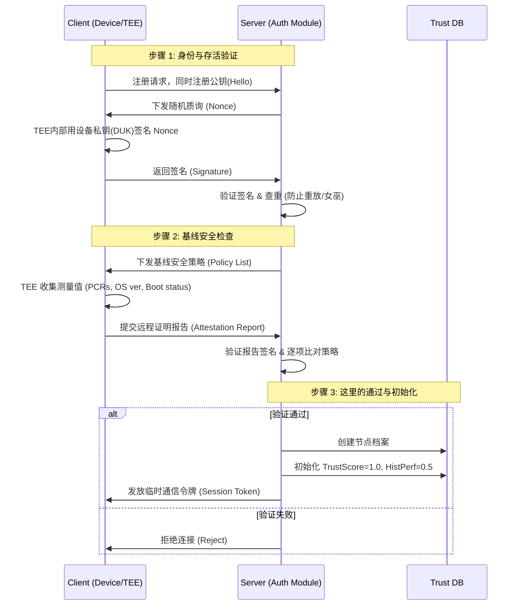

阶段一

根据你提供的《论文体系.md》和其他设计文档，**阶段一（训练前：客户端准入与策略部署）** 的核心目标是**“守门（Gatekeeping）”**。

它的任务非常明确：在任何训练开始之前，通过**密码学手段**和**硬性规则**，把“女巫节点”（模拟器/假身份）和“裸奔节点”（不安全设备）挡在门外，并为进入系统的节点初始化信誉档案。

以下是实现阶段一的具体方案，包含逻辑流程、交互协议设计和仿真代码。

---

### 一、 核心逻辑架构

阶段一的实现主要分为两个并行的握手协议：

1. **身份握手 (Identity Handshake):** 验证“你是真的硬件吗？” $\rightarrow$ 防御女巫攻击。
2. **环境握手 (Environment Handshake):** 验证“你安全吗？” $\rightarrow$ 防御环境漏洞利用。

#### 交互时序图 (Sequence Diagram)

---

### 三、 论文中的描述与落地细节

在论文的 **Implementation** 或 **Methodology - Phase 1** 章节中，你需要强调以下技术点来提升档次：

#### 1. 硬件绑定的防御 (Hardware-bound Defense)

- **话术：** “我们利用 Intel SGX DCAP (Data Center Attestation Primitives) 或 TPM 2.0 的 **Endorsement Key (EK)** 来实现设备唯一性认证。”
- **解释：** 强调私钥是无法被读取、复制的。这就从物理上杜绝了攻击者用一台高性能服务器模拟 1000 个客户端（Sybil Attack）的可能性。

#### 2. 非交互式与交互式结合

- **Nonce 的作用：** 在代码中 `nonce` 是服务器随机生成的字符串。
- **目的：** 防止**重放攻击 (Replay Attack)**。如果攻击者截获了前几天的“验证通过数据包”，今天再发一遍，因为服务器的 Nonce 变了，旧的签名直接失效。

#### 3. 策略的具体项 (Policy Requirements)

列出你具体检查的清单，这体现了工程化的细致程度：

- **Secure Boot:** 确保 Bootloader 没有被植入后门。
- **IMA (Integrity Measurement Architecture):** Linux 内核级的文件完整性度量。
- **No Root:** 确保 FL 客户端进程不会被其他高权限进程 ptrace 或 dump 内存。

#### 4. 信誉的冷启动 (Cold Start initialization)

结合之前的讨论，明确在这一步进行信誉初始化：

- $HistPerf_k^{(0)} = 0.5$ (中立启动)。
- $TrustScore_k = 1.0$ (只要能进门，说明当前环境是安全的)。
- 这为后续阶段的计算提供了初始值。
