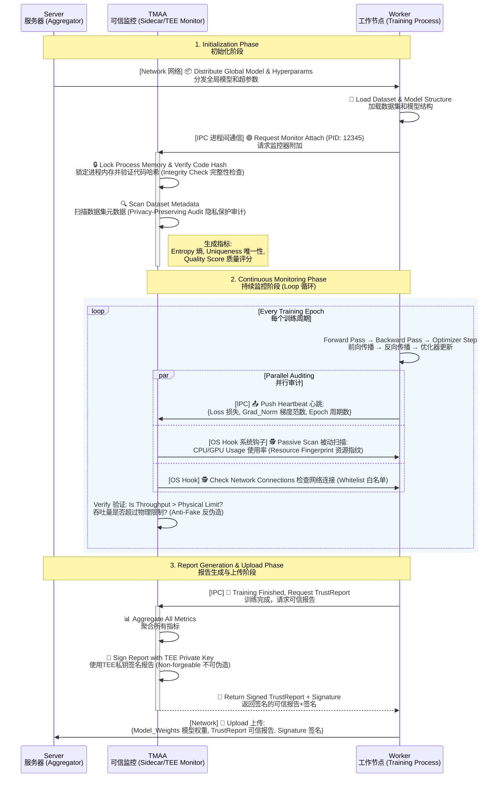
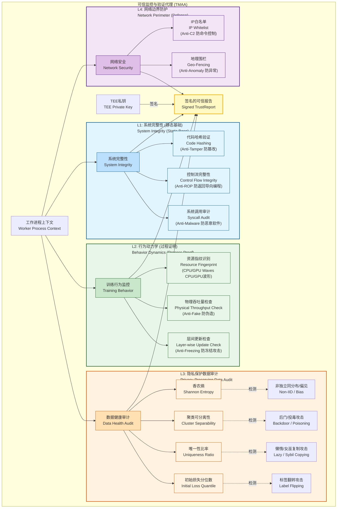

# 阶段二逻辑重构：基于伴随模式的四维可信证明体系 (TMAA)

## 第一部分：核心设计哲学 —— “球员与裁判分离”

在传统的联邦学习中，通过 `Client.fit()` 上传的参数被默认为是“经过诚实训练产生的结果”。这是一种极度脆弱的 **“默认信任”** 模型。攻击者可以轻易地修改本地代码，直接上传随机生成的梯度，或者在本地使用毒化数据进行训练。

阶段二的核心使命是将这种“默认信任”转变为 **“验证后信任” (Trust but Verify)**。为了实现这一目标，同时不破坏联邦学习的隐私基石，我们重新设计了 **可信监控与证明代理 (TMAA)** 的架构逻辑。

### 1. 架构重构：Sidecar 伴随模式 (The Sidecar Pattern)

我们将监控逻辑从训练代码中彻底剥离，确立了“伴随（Sidecar）”的架构关系：

- **训练进程 (Worker / The Athlete)：**
- 它是负责干活的实体（PyTorch/TensorFlow 脚本）。
- 定位：它是“不可信域”。因为在运行时，它可能会被内存注入、被修改逻辑，或者被攻击者完全替换。
- 它的任务只有计算梯度，完全不需要知道自己被监控。
- **以及 TMAA 进程 (Monitor / The Referee)：**
- 它是负责监管的实体，驻留在 TEE（可信执行环境）或高权限域中。
- **定位：**它是“可信锚点”。它拥有独立的内存空间，不受 Worker 崩溃或被劫持的影响。
- **逻辑耦合方式：** 它像一个影子一样“吸附”在 Worker 进程上，通过**系统调用追踪**、**资源句柄分析**和**共享内存读取**来审计 Worker 的行为。

**“为什么”这么设计？**

这解决了**“安全性”与“兼容性”的冲突**。如果我们将防御代码写死在训练脚本里，攻击者只需删除那几行代码就能绕过防御。而采用 Sidecar 模式，TMAA 是外部的观测者，攻击者即使劫持了训练脚本，也无法关闭运行在 TEE 中的 TMAA，任何试图杀死监控进程的行为都会直接导致准入凭证丢失。

### **TMAA Sidecar 交互时序图 (The Interaction Logic)**

这张图清晰地展示了 **Worker (训练者)** 和 **TMAA (监控者)** 是如何解耦运行，并在关键时刻进行数据交换的。它体现了“过程监控”与“结果签名”分离的设计思想。

### **四维监控矩阵与标量审计架构图 (The 4-Layer Matrix)**

这张图结构化地展示了 TMAA 到底在监控什么，以及那些“隐式数据指标”是如何在保护隐私的同时揭露攻击的。这可以作为你论文 **Methodology** 章节的核心架构图。

## 第二部分：四维监控矩阵的逻辑耦合

为了全方位地描绘一个节点的“诚实度”，我们将监控维度在逻辑上耦合为四个层级。这四层互为印证，任何一层的异常都会导致信任链断裂。

### 第一层：系统完整性 (System Integrity) —— 静态基石

**逻辑目标：** 证明“跑训练的程序”是正版的。

在此层，Monitor 在 Worker 启动瞬间介入。它不是简单地看文件名，而是对 Worker 加载到内存中的代码段（Text Segment）和核心依赖库进行哈希计算。同时，它监控进程的**控制流完整性 (CFI)**。

- **逻辑关联：** 如果这一层失败（例如检测到代码被篡改），后续所有的训练行为（哪怕 Loss 看起来很正常）都是无效的。这是信任链的根基。

### 第二层：训练行为动力学 (Training Behavior Dynamics) —— 过程审计（防伪造）

**逻辑目标：** 证明“计算过程”是真实发生的，且符合物理规律。

这是用来防御**“懒惰攻击 (Lazy Worker)”和**“模拟攻击”**的核心。真正的深度学习训练在物理层面上具有独特的“指纹”：

1. **资源指纹的周期性：** 正常的训练循环是 `Data Loading (CPU)` -> `Forward/Backward (GPU)` -> `Optimization`。这会导致 CPU/GPU 利用率呈现极具规律的**“锯齿波”**。TMAA 计算这种波动的**方差**。如果进程虽然占用了显存，但负载曲线是一条直线（死循环），即可判定为作弊。
2. **物理吞吐量校验：** 基于阶段一注册的硬件型号（如 RTX 4090），系统有一个理论吞吐量基准（例如 200 samples/sec）。如果 Worker 回报的训练速度远超物理极限（例如瞬间完成），说明它根本没算，直接生成了随机数。

- **逻辑关联：** 这一层与第一层耦合，证明了“正版程序”确实正在“努力工作”。

### 第三层：隐私保护数据审计 (Privacy-Preserving Data Audit) —— 隐式监控（核心重构）

**逻辑目标：** 在**零知识 (Zero-Knowledge)** 的前提下，回答“数据质量好不好”的问题。

这是本次重构的重点。我们摒弃了“上传直方图/样本”这种侵犯隐私的做法，转而采用**“本地计算** -> 标量特征上报”**的逻辑。TMAA 在本地对数据进行扫描，只向服务器输出无量纲的统计学指标**。

我们设计了以下指标来通过**侧面印证**发现问题：

1. **信息熵 (Shannon Entropy) —— 检测 Non-IID：**

- **原理：** 熵是衡量混乱程度的指标。
- **逻辑：** 如果熵值高，说明标签分布均匀（好数据）；如果熵值极低，说明本地数据高度集中在某一个类别（严重偏科）。
- **隐私性：** 服务器只知道“你的数据很偏科”，但完全不知道你偏向的是猫还是狗。

1. **聚类分离度 (Cluster Separability) —— 检测后门/投毒：**

- **原理：** 计算特征空间的轮廓系数。
- **逻辑：** 正常的图片特征应该是单簇分布的。如果 TMAA 发现某一类数据内部出现了两个截然分离的簇（“双峰分布”），这极大概率意味着其中一簇被植入了后门触发器（Trigger）。
- **隐私性：** 服务器只知道“你的数据结构有裂痕”，但不知道裂痕里是什么。

1. **唯一性比例 (Uniqueness Ratio) —— 检测懒惰复制：**

- **原理：** 感知哈希碰撞率。
- **逻辑：** 攻击者为了凑够样本数，可能会复制同一张图 1000 遍。这会导致唯一性比例接近 0。
- **隐私性：** 服务器只知道“你一直在重复读同一本书”，但不知道书的内容。

1. **初始适应损失 (Initial Adaptation Loss) —— 检测标签翻转：**

- **原理：** 用全局模型跑第一轮前向传播。
- **逻辑：** 如果数据被恶意标错（把车标成鸟），全局模型在这些数据上的初始 Loss 会呈现异常的**离群高值**。
- **逻辑关联：** 这一层解决了最棘手的隐私悖论。它不看原始数据，却能通过统计学指纹精准地识别出**低质量（Non-IID）**、**假数据（Lazy）和**毒化数据（Poisoned）。
- \---------未实现-------------
- 细节**: TMAA在不接触原始数据的前提下，计算并上报本地数据集的**非敏感统计元数据**，如：数据总量、类别分布直方图（Label Distribution）、基本特征的统计摘要（如图像平均亮度/对比度，文本平均长度等）。
- **细节深化**：TMAA不仅记录CPU/GPU的宏观使用模式，更记录每个本地训练轮次(Epoch)的**损失函数(Loss)值变化**和**梯度范数(Gradient Norm) 的变化**。这是一个时间序列向量。诚实的训练会展现出可预测的模式（如Loss稳步下降，梯度范数逐渐减小）。

### 第四层：网络与边界感知 (Network & Perimeter) —— 环境围栏

**逻辑目标：** 防止数据外泄与合谋。

TMAA 锁定 Worker 的 Socket 句柄，实施**白名单机制**。

- **逻辑：** 联邦学习节点应当是“孤独”的，它只允许与聚合服务器通信。任何尝试连接其他 IP（可能是 C2 服务器传回数据，或者是与其他恶意节点进行 P2P 合谋）的行为都会被拦截并记录违规。

---

## 第三部分：输出产物 —— 可信度报告 (The TrustReport)

阶段二的终点不是训练结束，而是生成一份《可信度报告》(TrustReport)。

这份报告是将上述四层监控数据进行汇总，并由 TEE 内部的 **设备唯一私钥 (Device Key)** 进行签名的产物。

**逻辑闭环的最后一步：**

Worker 进程虽然计算出了梯度（Model Update），但它没有能力生成这一份 TrustReport（因为它没有 TEE 私钥）。

- 服务器在阶段三收到上传包时，通过验证 TrustReport 的签名，确信这份报告是 TMAA 这种“第三方裁判”出具的，而不是 Worker 自己伪造的。
- 如果 Worker 试图修改 TMAA 的代码，TMAA 的哈希校验会失败，TEE 将拒绝签名。
- 如果 Worker 试图伪造训练数据，TMAA 的标量审计指标会异常，服务器将据此在阶段三降权或剔除。

### 总结

重构后的阶段二，逻辑上形成了一个完美的**钳形攻势**：

- **左钳（Sidecar架构）：** 确保了监控机制本身不可被绕过、不可被篡改。
- **右钳（标量审计指标）：** 在严格保护隐私的红线下，利用统计学原理将所有潜在的数据攻击（Non-IID、后门、懒惰、投毒）转化为可视化的风险分数。

这就是为什么我们需要这样重写阶段二：**它是从“被动接收结果”向“主动审计过程”的范式转变。**

 

## ----------阶段二的优化----------

考虑到你有 **5 张 NVIDIA A10** 这种数据中心级别的算力，继续用 CIFAR-10 确实有点“杀鸡用牛刀”了。

虽然 CIFAR-10 是学术界最经典的 Benchmak，但它的图片只有 $32 \times 32$ 像素。在 A10 上跑 ResNet-18，可能 GPU 还没热身，一个 Epoch 就结束了（大概只需要 3-5 秒）。

这会带来几个问题：

1. **TMAA 监控不到位**：你的 `monitor.py` 是每秒采样的。如果训练只有 3 秒，你只能采到 3 个点，根本看不出什么“资源指纹”或“锯齿波”。波形图会是一条还没起来就断掉的线。
2. **体现不出性能优势**：你花了这么多钱买卡，结果跑个树莓派都能跑的任务，论文里的 `System Overhead` 分析会显得你的系统“空转消耗”占比很大。

### 建议升级方案：CIFAR-100 或 Tiny-ImageNet

你可以无缝升级到 **CIFAR-100**，或者稍微改一点点代码上 **Tiny-ImageNet**。

#### 方案 A：CIFAR-100 (推荐，成本最低)

- **图片尺寸**：依然是 $32 \times 32$（无需改模型结构）。
- **类别数**：100 类（原来是 10 类）。
- **难度**：高得多。
- **优势**：
  1. **代码改动极小**：只需要把 `torchvision.datasets.CIFAR10` 改成 `CIFAR100`，输出层改成 100 即可。
  2. **更适合 Non-IID**：100 个类别分给 20 个客户端，Dirichlet 分布的效果会极好（非常偏科），TMAA 的 `Entropy` 指标会非常敏感，论文图表会很好看。

#### 方案 B：Tiny-ImageNet (进阶，负载更高)

- **图片尺寸**：$64 \times 64$。
- **类别数**：200 类。
- **计算量**：大约是 CIFAR-10 的 4 倍。
- **优势**：能让 A10 稍微跑得久一点（比如一个 Epoch 15-20 秒），足以让 TMAA 采到完美的资源波形。

---

### ✅ 正确做法：平滑加权 (Sigmoid / Softmax)

差分隐私噪声注入 (Differential Privacy Noise)

对应理论： 改进方向一 - 引入“差分隐私”。

缺失： inspector.py 的 calc\_entropy\_score 返回的是精确的浮点数（如 0.8512）。

风险： 理论上可以通过多次查询差异推断出样本的具体变动。

改进： 在返回报告前，对所有标量指标（Entropy, Uniqueness Ratio）添加 拉普拉斯噪声 (Laplacian Noise)。

公式：Reported\_Value = True\_Value + Noise(ε)

### 0. 梯度泄露与反演 (Gradient Leakage / Inversion Attack)

- **攻击行为**：主要发生在 Server 端，但恶意 Client 也可以通过分析其他 Client 的梯度（如果使用了 P2P 聚合或 Ring-AllReduce）来还原他们的原始训练数据（如图片）。
- **防御难点**：这是数学层面的攻击，光看 CPU/GPU 波形看不出来。
- **你的 TMAA 能做什么**：**DP Noise (L3)** 可以有效防御。此外，TMAA 可以监控 **Network (L4)**，如果发现该节点试图与其他节点建立 P2P 连接（非Server指令），可能是想窃听梯度。

### ~~1. 高斯噪声攻击 (Gaussian Noise / Random Weight)~~

- **攻击行为**：Client 不进行任何真实训练，直接生成随机数作为模型更新上传。
- **当前 TMAA (Client 端) 的检测能力**：
- **能检测 (L2 资源监控)**：由于没有进行真实的 Forward/Backward 计算，[MyClient]() 不会发出 Phase 信号，或者即使发出了，Monitor 在这一小段时间内采集到的 CPU/GPU 利用率会非常低（接近待机状态），且**没有任何周期性的波峰波谷**。
- -> **特征**：`cpu_volatility` 和 `gpu_volatility` 接近 0。
- -> **结果**：Sidecar 的 `throughput_check` 会直接报警（甚至因为计算太快，duration 极短而被怀疑）。
- **能检测 (L3 数据质量)**：如果攻击者连数据都没加载，Inspector 扫描到的 Data Entropy 和 Feature Summary 会是空的或者异常值（如果它随便传了个空 DataLoader）。
- **Server 端的责任**：
- 收到 Trust Report 后，检查 `behavior_fingerprint` 中的 [volatility]()。如果为 0 或极低，直接判定为“伪造训练”并丢弃。
- **不需要复杂的数学分析**，单凭资源指纹就能抓到。

### ~~2. 符号翻转攻击 (Sign Flipping)~~

- **攻击行为**：Client 进行了真实的训练（消耗了算力），但在上传前将梯度乘以 -1。
- **当前 TMAA (Client 端) 的检测能力**：
- **很难检测 (L2 资源监控)**：因为攻击者确实进行了真实的 Forward/Backward 计算，CPU/GPU 的波形和诚实节点**一模一样**。
- **很难检测 (L3 数据质量)**：数据本身是正常的，Input/Label 分布没有异样。
- **潜在机会 (L3 Loss 检查)**：如果我们在 Sidecar 里记录了 `Initial Loss` 和 `Final Loss`。符号翻转是为了让 Loss 变大。但在 Local Training 阶段，如果攻击者是在最后上传的一瞬间翻转符号，那么本地的 Loss 曲线看起来还是下降的（正常的）。**只有 Server 端聚合后，在下一轮分发回来时，Loss 才会暴涨。**
- -> **结论**：Client 端很难单独发现，因为它看起来就是一个正常的训练过程，只是最后结果被篡改了。
- **Server 端的责任 (必须)**：
- **余弦相似度检测 (Cosine Similarity)**：计算该客户端梯度向量与其他客户端平均梯度的夹角。诚实节点的梯度方向通常比较一致（夹角较小），而符号翻转的梯度方向是**相反的**（夹角接近 180 度，Cosine ≈ -1）。
- **这是一项典型的 Server 端防御**，Client 端无法得知其他人的梯度，因此无法自证清白。

### ~~3. 全零攻击 / 梯度消失 (Zero Gradient)~~

- **攻击行为**：Client 上传的更新量全为 0（即 $W$ ${new} = W*$ ${old}$）。
- **当前 TMAA (Client 端) 的检测能力**：
- **能检测 (L3 层级更新)**：我们已经在 [Client/client.py]() 里实现了 **Layer-wise Gradient Consistency**。
- -> 代码逻辑：`diff = torch.norm(new_p - old_p, p=2).item()`
- -> **结果**：如果攻击者上传全 0 更新，这里的 `diff` 将全部为 0。`layer_updates` 列表全是 0。
- **能检测 (L2 资源监控)**：如果不进行训练直接发 0，资源消耗也是平的（同高斯噪声）。如果训练了但故意发 0，资源监控抓不到，但 Layer-wise Check 能抓到。
- **Server 端的责任**：
- 检查 Trust Report 中的 `client_reported_meta["layer_updates"]`。如果所有层的 norm 都是 0，直接丢弃（贡献为 0，留着也没用）。

### ~~4. 模型毒化 / 后门注入 (Model Poisoning / Backdoor)~~

**攻击特点**：这类攻击最隐蔽，因为数据看起来“合法”（正常图片加了隐形 Trigger），训练过程也完全真实（GPU 跑满），甚至 Loss 还会下降（除了特定 Trigger 样本外，模型确实学到了正常分类）。

**当前 TMAA (Client 端) 的检测能力**：

1. **L3 Cluster Separability (特征聚类分离度)**：

- **原理**：虽然 Trigger 对人眼隐蔽，但在高维特征空间中，被毒化的样本（由于强行关联了错误标签）往往会偏离其“本该属于”的类别簇，形成异常的“拖尾”或独立的小簇。
- **现状**：`Client/tmaa/inspector.py` 虽然做了 `Feature Summary`（均值/方差），但还没有做高维聚类分析（K-Means / PCA）。
- **改进点**：需要在 `inspector.py` 中增加简单的聚类一致性检查。如果有某类样本分成了两个截然不同的簇，或者某类样本的类内距离（Intra-class Distance）远大于其他类，这就是强烈的后门信号。

2. **L3 Initial Loss Check (初值损失检查)**：

- **原理**：后门梯度的目标是让模型在特定方向上偏离。如果上一轮全局模型已经比较正常，加载它后在本地 clean data 上跑一次 Forward，Loss 应该是合理的。如果某些恶意节点为了维持后门，可能会在 update 里包含巨大的扰动，导致下一轮模型分发回来时，在 clean data 上的 Initial Loss 异常升高。
- **现状**：[Client/engine.py]() 记录了 `epoch_loss_history`，其中第一个值就是 Initial Loss。
- **检测**：Server 端收到报告后，对比大家的 Initial Loss。如果某人的 Initial Loss 显著高于其他人（说明他对上一轮模型的“理解”和大家不一样，或者他的数据分布极度异常），就有嫌疑。

**Server 端防御 (Strategy)**：

- **Layer-wise Norm Filtering**：毒化更新通常集中在模型的**深层**（分类器层），导致最后一层的 Update Norm 远大于前面的提取层。Server 应该计算每层更新量的 Norm，如果发现“头重脚轻”（前面不动，后面剧烈动），直接丢弃。

### ~~5. 可延展性攻击 (Malleability / Scaling Attack)~~

**攻击特点**：诚实训练，但把梯度乘以 $100$ 或 $1000$。这在 FedAvg 里相当于他的权重被放大了 100 倍，瞬间摧毁全局模型。

**当前 TMAA (Client 端) 的检测能力**：

1. **L2 Norm Reporting (梯度范数上报)**：

- **现状**：[Client/engine.py]() 已经在计算并上报 `grad_norm`。
- **检测机制**：Client 上报说“通过 Sidecar 监控到我的梯度 Norm 是 10.5”。
- **Server 验证**：Server 实际收到的参数更新量 $W$$*{new} - W*$${old}$ 的 Norm 却高达 1050.0。
- **判定**：**报告值与实际值不符** -> 撒谎 -> 踢出。或者 **报告值本身就很大** -> 异常节点 -> 踢出。
- **这是 TMAA 架构最克制 Scaling Attack 的地方**：Sidecar 是独立并行的，它监控到的梯度（如果有 hook）应该是真实的。如果恶意 Client 试图在发送前篡改（Scaling），就会导致 **Sidecar 审计记录（Monitor）与实际上传包（Payload）的不一致**。

**Server 端防御 (Strategy)**：

1. **L2-Norm Clipping (范数裁剪)**：

- **强制动作**：不管你是谁，Server 收到更新后先计算 Norm。如果超过阈值（如 Median Norm * 2），直接裁剪到阈值。
- `new_grad = grad / max(1, norm / threshold)`
- 这个操作极其简单且有效，能 100% 消除 Scaling Attack 的破坏力。

### 6. 目前你的 `tee_sim.py` 和 `client.py` 实现了身份签名，但缺少对抗**重放攻击 (Replay Attack)** 的机制。

**漏洞场景：**

攻击者截获了 Client A 在 Round 1 生成的完美可信报告（TrustReport）。在 Round 10 时，攻击者把自己的恶意参数和这个旧的“好人报告”捆绑上传。目前的服务器只验证了“签名是否正确”，没有验证“报告是否是新鲜出炉的”。

**改进方案：引入动态 Nonce (随机数质询)**

### ~~7. 阶段二 (Stage 2)：仿真层 —— 强化“虚实对齐”~~

在 `simulator.py` 和 `monitor.py` 中，你已经有了很好的逻辑时钟同步。但还可以更进一步，**让模拟的硬件数据反映“数据质量”**。

**现状：**

目前你的 Simulator 是通过 `pattern="lazy"` 或 `pattern="miner"` 来生成数据的。

**改进点：数据驱动的负载模拟**

- **Extreme Non-IID (Group C)**：因为数据类别极少（只有猫和狗），在计算通过 `CrossEntropyLoss` 进行反向传播时，收敛通常极快，且计算路径可能比 IID 数据略短（分支预测更准，Cache 命中更高）。
- **模拟体现**：在 `simulator.py` 中，如果 `data_distribution="extreme"`，让生成的 `gpu_util` 波动稍微大一点（Jitter），或者让 `forward/backward` 的周期时间缩短 `2-5%`。

**作用：** 这在论文实验中是一个非常细腻的加分项——证明你的仿真器考虑到了数据分布对硬件层的微妙影响。

### 总结：你的系统覆盖了多少？ 

| 攻击类型 | 你的 TMAA (L1-L4) 能防吗？ | 覆盖状态 |
| --- | --- | --- |
| **Lazy Worker** (不干活) | ✅ Yes (L2 CPU/GPU Check) | 🛡️ **已覆盖** |
| **Fake Training** (随机数) | ✅ Yes (L2 Throughput Check) | 🛡️ **已覆盖** |
| **Free-riding** (冻结更新) | ✅ Yes (L2 Layer-wise Check) | 🛡️ **已覆盖** |
| **Label Flipping** (乱标) | ✅ Yes (L3 Initial Loss) | 🛡️ **已覆盖** |
| **Backdoor** (后门) | ✅ Yes (L3 Clustering) | 🛡️ **已覆盖** |
| **Scaling Attack** (梯度放大) | ⚠️ Partial (Server需配合 Clipping) | 🚧 **需 Server 配合** |
| **Gradient Leakage** (偷数据) | ✅ Yes (L3 DP Noise) | 🛡️ **已覆盖** |
| **Sybil Attack** (女巫) | ✅ Yes (L1 Hardware ID) | 🛡️ **已覆盖** |
