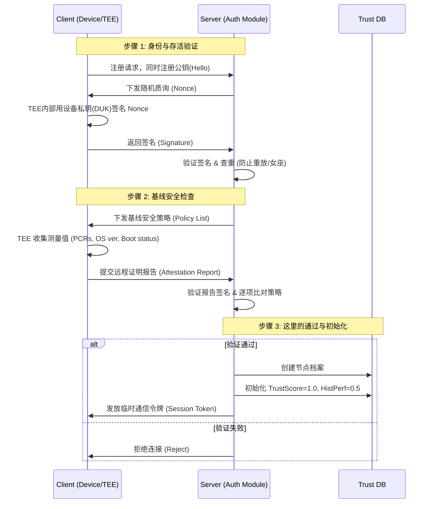

阶段一

根据你提供的《论文体系.md》和其他设计文档，**阶段一（训练前：客户端准入与策略部署）** 的核心目标是**“守门（Gatekeeping）”**。

它的任务非常明确：在任何训练开始之前，通过**密码学手段**和**硬性规则**，把“女巫节点”（模拟器/假身份）和“裸奔节点”（不安全设备）挡在门外，并为进入系统的节点初始化信誉档案。

以下是实现阶段一的具体方案，包含逻辑流程、交互协议设计和仿真代码。

---

###  一、 核心逻辑架构

阶段一的实现主要分为两个并行的握手协议：

1. **身份握手 (Identity Handshake):** 验证“你是真的硬件吗？” $\rightarrow$ 防御女巫攻击。
2. **环境握手 (Environment Handshake):** 验证“你安全吗？” $\rightarrow$ 防御环境漏洞利用。

####  交互时序图 (Sequence Diagram)



---

###  二、 具体实现步骤与代码逻辑

**落地架构与目录结构**

我们将构建一个微服务架构：

1. **Server Container (1个):** 扮演 Gatekeeper，运行 Flask Web 服务，监听注册请求。
2. **Client Containers (N个):** 扮演 FL 节点，运行 Python 脚本，模拟 TEE 行为。
3. **Attacker Container (可选):** 模拟女巫攻击节点。

**推荐的项目目录结构：**

```text
fl-security-simulation/
├── docker-compose.yml       # 编排文件，一键启动所有节点
├── server/
│   ├── Dockerfile
│   ├── app.py               # 服务器端逻辑 (Gatekeeper)
│   └── requirements.txt
└── client/
    ├── Dockerfile
    ├── client_main.py       # 客户端主程序
    ├── tee_sim.py           # 模拟 TEE 硬件类 (复用之前的代码)
    └── requirements.txt
```

####  1. 模拟 TEE 硬件模块 (Client Side)

1. 在客户端，你需要封装一个类，模拟 TEE/TPM 的不可导出密钥功能。
  ```python
  # client/tee_sim.py
  import os
  import json
  import logging
  from pathlib import Path
  from typing import Dict, Optional
  from datetime import datetime
  from cryptography.hazmat.primitives.asymmetric import rsa, padding
  from cryptography.hazmat.primitives import serialization, hashes
  from cryptography.hazmat.backends import default_backend
  from cryptography.exceptions import InvalidSignature
  # 配置日志
  logging.basicConfig(
  level=logging.INFO,
  format='%(asctime)s - %(name)s - %(levelname)s - %(message)s'
  )
  logger = logging.getLogger(__name__)
  class TEEConfig:
  """TEE 配置参数"""
  KEY_SIZE = 2048
  KEY_PATH = Path("/data/duk.pem")
  METADATA_PATH = Path("/data/device_metadata.json")
  # 默认系统状态（诚实节点）
  DEFAULT_STATUS = {
  "os_version": "Ubuntu 22.04 LTS",
  "secure_boot": True,
  "disk_encryption": True,
  "root_access": False,
  "tee_enabled": True,
  "kernel_version": "5.15.0",
  "last_boot": None
  }
  class HardwareSimulationError(Exception):
  """硬件模拟相关异常"""
  pass
  class SimulatedTEE:
  """
  模拟可信执行环境（TEE）
  核心功能:
  1. 持久化硬件密钥对（模拟 TPM/SGX Endorsement Key）
  2. 提供密码学签名服务
  3. 生成包含系统状态的远程证明报告
  """
  def __init__(self, device_id: str, malicious_config: Optional[Dict] = None):
  """
  初始化 TEE 环境
  Args:
  device_id: 设备唯一标识符
  malicious_config: 可选的恶意配置（用于攻击模拟）
  """
  self.device_id = device_id
  self.backend = default_backend()
  # 确保数据目录存在
  self._ensure_data_directory()
  # 加载或生成硬件密钥
  self._private_duk: rsa.RSAPrivateKey = None
  self.public_duk: rsa.RSAPublicKey = None
  self._load_or_generate_key()
  # 初始化系统状态
  self.system_status = TEEConfig.DEFAULT_STATUS.copy()
  self.system_status["last_boot"] = datetime.now().isoformat()
  # 应用恶意配置（如果提供）
  if malicious_config:
  self._apply_malicious_config(malicious_config)
  logger.warning(f"⚠️  Device {device_id}: Malicious configuration applied")
  # 加载或创建元数据
  self._load_or_create_metadata()
  def _ensure_data_directory(self):
  """确保数据持久化目录存在"""
  try:
  TEEConfig.KEY_PATH.parent.mkdir(parents=True, exist_ok=True)
  except Exception as e:
  raise HardwareSimulationError(f"Failed to create data directory: {e}")
  def _load_or_generate_key(self):
  """
  加载或生成硬件密钥对
  模拟 TPM/SGX 的密钥烧录过程：
  - 如果密钥文件存在，从文件加载（模拟从芯片读取）
  - 如果不存在，生成新密钥并持久化（模拟出厂烧录）
  """
  if TEEConfig.KEY_PATH.exists():
  logger.info(f"🔑 Loading existing hardware key for device {self.device_id}")
  try:
  with open(TEEConfig.KEY_PATH, "rb") as key_file:
  self._private_duk = serialization.load_pem_private_key(
  key_file.read(),
  password=None,
  backend=self.backend
  )
  except Exception as e:
  raise HardwareSimulationError(f"Failed to load hardware key: {e}")
  else:
  logger.info(f"🔥 Burning new hardware key into simulated chip for {self.device_id}")
  try:
  # 生成 RSA 密钥对（模拟芯片出厂时的一次性烧录）
  self._private_duk = rsa.generate_private_key(
  public_exponent=65537,
  key_size=TEEConfig.KEY_SIZE,
  backend=self.backend
  )
  # 持久化私钥（模拟存储到芯片的非易失性存储）
  with open(TEEConfig.KEY_PATH, "wb") as f:
  f.write(self._private_duk.private_bytes(
  encoding=serialization.Encoding.PEM,
  format=serialization.PrivateFormat.PKCS8,
  encryption_algorithm=serialization.NoEncryption()
  ))
  # 设置严格的文件权限（模拟硬件保护）
  os.chmod(TEEConfig.KEY_PATH, 0o400)
  except Exception as e:
  raise HardwareSimulationError(f"Failed to generate hardware key: {e}")
  # 派生公钥
  self.public_duk = self._private_duk.public_key()
  def _load_or_create_metadata(self):
  """加载或创建设备元数据"""
  if TEEConfig.METADATA_PATH.exists():
  try:
  with open(TEEConfig.METADATA_PATH, "r") as f:
  self.metadata = json.load(f)
  except Exception as e:
  logger.warning(f"Failed to load metadata: {e}, creating new")
  self.metadata = self._create_default_metadata()
  else:
  self.metadata = self._create_default_metadata()
  self._save_metadata()
  def _create_default_metadata(self) -> Dict:
  """创建默认元数据"""
  return {
  "device_id": self.device_id,
  "created_at": datetime.now().isoformat(),
  "boot_count": 0,
  "attestation_count": 0
  }
  def _save_metadata(self):
  """保存元数据"""
  try:
  with open(TEEConfig.METADATA_PATH, "w") as f:
  json.dump(self.metadata, f, indent=2)
  except Exception as e:
  logger.error(f"Failed to save metadata: {e}")
  def _apply_malicious_config(self, config: Dict):
  """
  应用恶意配置（用于攻击模拟）
  Args:
  config: 包含要修改的系统状态的字典
  """
  for key, value in config.items():
  if key in self.system_status:
  old_value = self.system_status[key]
  self.system_status[key] = value
  logger.warning(
  f"⚠️  Malicious config: {key} changed from {old_value} to {value}"
  )
  def get_public_key_pem(self) -> str:
  """
  导出公钥（PEM 格式）
  Returns:
  PEM 编码的公钥字符串
  """
  return self.public_duk.public_bytes(
  encoding=serialization.Encoding.PEM,
  format=serialization.PublicFormat.SubjectPublicKeyInfo
  ).decode('utf-8')
  def sign_data(self, data: str) -> str:
  """
  使用硬件私钥对数据签名
  Args:
  data: 待签名的数据字符串
  Returns:
  十六进制编码的签名
  Note:
  模拟 TPM/SGX 的签名操作：私钥永不离开芯片，
  只能通过接口调用进行签名运算
  """
  try:
  signature = self._private_duk.sign(
  data.encode('utf-8'),
  padding.PSS(
  mgf=padding.MGF1(hashes.SHA256()),
  salt_length=padding.PSS.MAX_LENGTH
  ),
  hashes.SHA256()
  )
  return signature.hex()
  except Exception as e:
  raise HardwareSimulationError(f"Signature generation failed: {e}")
  def generate_attestation_report(self) -> Dict:
  """
  生成远程证明报告
  Returns:
  包含系统测量值和签名的报告字典
  Note:
  模拟 Intel SGX Quote 或 TPM Quote 的生成过程
  """
  # 更新统计信息
  self.metadata["attestation_count"] += 1
  self._save_metadata()
  # 构建报告主体
  report_body = {
  "device_id": self.device_id,
  "measurements": self.system_status.copy(),
  "metadata": {
  "boot_count": self.metadata["boot_count"],
  "attestation_count": self.metadata["attestation_count"],
  "timestamp": datetime.now().isoformat()
  }
  }
  # 对报告进行签名
  report_json = json.dumps(report_body, sort_keys=True)
  signature = self.sign_data(report_json)
  logger.info(f"📋 Generated attestation report #{self.metadata['attestation_count']}")
  return {
  **report_body,
  "signature": signature
  }
  def verify_own_signature(self, data: str, signature_hex: str) -> bool:
  """
  验证自己的签名（用于测试）
  Args:
  data: 原始数据
  signature_hex: 十六进制签名
  Returns:
  签名是否有效
  """
  try:
  signature = bytes.fromhex(signature_hex)
  self.public_duk.verify(
  signature,
  data.encode('utf-8'),
  padding.PSS(
  mgf=padding.MGF1(hashes.SHA256()),
  salt_length=padding.PSS.MAX_LENGTH
  ),
  hashes.SHA256()
  )
  return True
  except InvalidSignature:
  return False
  def increment_boot_count(self):
  """增加启动计数"""
  self.metadata["boot_count"] += 1
  self.system_status["last_boot"] = datetime.now().isoformat()
  self._save_metadata()
  logger.info(f"🔄 Boot count: {self.metadata['boot_count']}")
  # 用于测试的辅助函数
  def create_honest_tee(device_id: str) -> SimulatedTEE:
  """创建诚实节点的 TEE"""
  return SimulatedTEE(device_id)
  def create_malicious_tee(device_id: str, attack_type: str = "rooted") -> SimulatedTEE:
  """
  创建恶意节点的 TEE
  Args:
  device_id: 设备 ID
  attack_type: 攻击类型 ('rooted', 'no_secure_boot', 'no_encryption')
  """
  malicious_configs = {
  "rooted": {"root_access": True},
  "no_secure_boot": {"secure_boot": False},
  "no_encryption": {"disk_encryption": False},
  "compromised": {
  "root_access": True,
  "secure_boot": False,
  "tee_enabled": False
  }
  }
  config = malicious_configs.get(attack_type, {"root_access": True})
  return SimulatedTEE(device_id, malicious_config=config)
  if __name__ == "__main__":
  # 简单的单元测试
  print("Testing SimulatedTEE...")
  # 测试诚实节点
  honest_tee = create_honest_tee("test_device_001")
  print(f"\n✓ Honest TEE created")
  print(f"  Public Key (first 100 chars): {honest_tee.get_public_key_pem()[:100]}...")
  # 测试签名
  test_data = "Hello, Federation!"
  signature = honest_tee.sign_data(test_data)
  is_valid = honest_tee.verify_own_signature(test_data, signature)
  print(f"\n✓ Signature test: {'PASS' if is_valid else 'FAIL'}")
  # 测试证明报告
  report = honest_tee.generate_attestation_report()
  print(f"\n✓ Attestation report generated:")
  print(f"  Secure Boot: {report['measurements']['secure_boot']}")
  print(f"  Root Access: {report['measurements']['root_access']}")
  # 测试恶意节点
  malicious_tee = create_malicious_tee("test_device_bad", "rooted")
  mal_report = malicious_tee.generate_attestation_report()
  print(f"\n⚠️  Malicious TEE report:")
  print(f"  Root Access: {mal_report['measurements']['root_access']}")
  ```
2. 客户端主程序
  ```python
  # client/client_main.py
  import os
  import sys
  import time
  import requests
  import logging
  from typing import Optional, Dict
  from datetime import datetime
  from requests.exceptions import RequestException, ConnectionError, Timeout
  from tee_sim import SimulatedTEE, create_honest_tee, create_malicious_tee
  # 配置日志
  logging.basicConfig(
  level=logging.INFO,
  format='%(asctime)s - %(name)s - %(levelname)s - %(message)s'
  )
  logger = logging.getLogger(__name__)
  class ClientConfig:
  """客户端配置"""
  # 服务器配置
  SERVER_HOST = os.getenv("SERVER_HOST", "fl-server")
  SERVER_PORT = int(os.getenv("SERVER_PORT", "5000"))
  SERVER_URL = f"http://{SERVER_HOST}:{SERVER_PORT}"
  # 设备配置
  DEVICE_ID = os.getenv("DEVICE_ID", f"client_{os.getpid()}")
  IS_MALICIOUS = os.getenv("IS_MALICIOUS", "false").lower() == "true"
  ATTACK_TYPE = os.getenv("ATTACK_TYPE", "rooted")
  # 重试配置
  MAX_RETRIES = 3
  RETRY_DELAY = 5  # 秒
  CONNECTION_TIMEOUT = 10  # 秒
  # 启动延迟（等待服务器就绪）
  STARTUP_DELAY = int(os.getenv("STARTUP_DELAY", "3"))
  class RegistrationError(Exception):
  """注册相关异常"""
  pass
  class VerificationError(Exception):
  """验证相关异常"""
  pass
  class FederatedLearningClient:
  """
  联邦学习客户端
  负责与服务器进行准入协议交互，包括：
  1. 设备注册与身份认证
  2. 环境证明报告提交
  3. 会话令牌获取
  """
  def __init__(self):
  self.device_id = ClientConfig.DEVICE_ID
  self.server_url = ClientConfig.SERVER_URL
  self.session_token: Optional[str] = None
  self.tee: Optional[SimulatedTEE] = None
  logger.info(f"🤖 Initializing FL Client: {self.device_id}")
  logger.info(f"📡 Target Server: {self.server_url}")
  def _wait_for_server(self):
  """等待服务器就绪"""
  logger.info(f"⏳ Waiting {ClientConfig.STARTUP_DELAY}s for server startup...")
  time.sleep(ClientConfig.STARTUP_DELAY)
  # 健康检查
  for attempt in range(ClientConfig.MAX_RETRIES):
  try:
  response = requests.get(
  f"{self.server_url}/health",
  timeout=ClientConfig.CONNECTION_TIMEOUT
  )
  if response.status_code == 200:
  logger.info("✓ Server is healthy")
  return True
  except RequestException as e:
  logger.warning(f"Health check attempt {attempt + 1} failed: {e}")
  if attempt < ClientConfig.MAX_RETRIES - 1:
  time.sleep(ClientConfig.RETRY_DELAY)
  logger.error("❌ Server not available after maximum retries")
  return False
  def _initialize_tee(self):
  """初始化 TEE 环境"""
  try:
  if ClientConfig.IS_MALICIOUS:
  logger.warning(f"⚠️  Initializing MALICIOUS node (Type: {ClientConfig.ATTACK_TYPE})")
  self.tee = create_malicious_tee(self.device_id, ClientConfig.ATTACK_TYPE)
  else:
  logger.info("✓ Initializing HONEST node")
  self.tee = create_honest_tee(self.device_id)
  self.tee.increment_boot_count()
  return True
  except Exception as e:
  logger.error(f"❌ TEE initialization failed: {e}")
  return False
  def _make_request(self, endpoint: str, payload: Dict, method: str = "POST") -> Dict:
  """
  发送 HTTP 请求（带重试机制）
  Args:
  endpoint: API 端点
  payload: 请求负载
  method: HTTP 方法
  Returns:
  响应 JSON
  """
  url = f"{self.server_url}{endpoint}"
  for attempt in range(ClientConfig.MAX_RETRIES):
  try:
  response = requests.request(
  method,
  url,
  json=payload,
  timeout=ClientConfig.CONNECTION_TIMEOUT
  )
  # 记录请求详情
  logger.debug(f"Request to {endpoint}: Status {response.status_code}")
  return response.json(), response.status_code
  except Timeout:
  logger.warning(f"Request timeout (attempt {attempt + 1}/{ClientConfig.MAX_RETRIES})")
  except ConnectionError:
  logger.error(f"Connection error (attempt {attempt + 1}/{ClientConfig.MAX_RETRIES})")
  except Exception as e:
  logger.error(f"Request failed: {e}")
  if attempt < ClientConfig.MAX_RETRIES - 1:
  time.sleep(ClientConfig.RETRY_DELAY)
  raise RequestException(f"Failed to connect to {url} after {ClientConfig.MAX_RETRIES} attempts")
  def register(self) -> str:
  """
  阶段 1: 设备注册
  Returns:
  服务器返回的 nonce
  Raises:
  RegistrationError: 注册失败
  """
  logger.info("📝 Step 1: Registering device with server...")
  payload = {
  "device_id": self.device_id,
  "public_key": self.tee.get_public_key_pem()
  }
  try:
  response, status_code = self._make_request("/register", payload)
  if status_code != 200:
  error_msg = response.get('message', 'Unknown error')
  raise RegistrationError(f"Registration rejected: {error_msg}")
  nonce = response.get('nonce')
  if not nonce:
  raise RegistrationError("Server did not return challenge nonce")
  logger.info(f"✓ Registration successful, received challenge")
  logger.debug(f"  Nonce: {nonce[:16]}...")
  return nonce
  except RequestException as e:
  raise RegistrationError(f"Network error during registration: {e}")
  def verify(self, nonce: str) -> str:
  """
  阶段 2: 身份验证与环境证明
  Args:
  nonce: 服务器质询随机数
  Returns:
  会话令牌
  Raises:
  VerificationError: 验证失败
  """
  logger.info("🔐 Step 2: Generating attestation and verifying identity...")
  # 生成签名（身份证明）
  signature = self.tee.sign_data(nonce)
  logger.info("  ✓ Challenge signed with hardware key")
  # 生成环境证明报告
  attestation_report = self.tee.generate_attestation_report()
  logger.info("  ✓ Attestation report generated")
  payload = {
  "device_id": self.device_id,
  "signature": signature,
  "attestation_report": attestation_report
  }
  try:
  response, status_code = self._make_request("/verify", payload)
  if status_code != 200:
  reason = response.get('reason', 'Unknown reason')
  logger.error(f"🚫 Verification FAILED: {reason}")
  raise VerificationError(reason)
  token = response.get('token')
  if not token:
  raise VerificationError("Server did not return session token")
  reputation = response.get('reputation', {})
  logger.info("✅ Verification SUCCESSFUL!")
  logger.info(f"  📊 Initial Reputation:")
  logger.info(f"     - TrustScore: {reputation.get('TrustScore', 'N/A')}")
  logger.info(f"     - HistPerf: {reputation.get('HistPerf', 'N/A')}")
  logger.info(f"  🎫 Session Token: {token[:16]}...")
  return token
  except RequestException as e:
  raise VerificationError(f"Network error during verification: {e}")
  def run_onboarding_flow(self) -> bool:
  """
  执行完整的准入流程
  Returns:
  是否成功加入联邦网络
  """
  start_time = datetime.now()
  logger.info(f"{'='*60}")
  logger.info(f"🚀 Starting Onboarding Process for {self.device_id}")
  logger.info(f"{'='*60}")
  try:
  # 前置检查
  if not self._wait_for_server():
  return False
  if not self._initialize_tee():
  return False
  # 执行准入协议
  nonce = self.register()
  self.session_token = self.verify(nonce)
  # 计算耗时
  elapsed = (datetime.now() - start_time).total_seconds()
  logger.info(f"{'='*60}")
  logger.info(f"🎉 ONBOARDING COMPLETE (took {elapsed:.2f}s)")
  logger.info(f"{'='*60}")
  return True
  except (RegistrationError, VerificationError) as e:
  logger.error(f"{'='*60}")
  logger.error(f"💥 ONBOARDING FAILED: {e}")
  logger.error(f"{'='*60}")
  return False
  except Exception as e:
  logger.critical(f"Unexpected error: {e}", exc_info=True)
  return False
  def enter_training_loop(self):
  """
  进入训练循环（占位符）
  实际应用中，这里会：
  1. 等待服务器下发训练任务
  2. 在 TEE 内部执行本地训练
  3. 上传模型更新
  4. 接收新的全局模型
  """
  logger.info("🔁 Entering training loop...")
  logger.info("   (In production, this would poll for FL tasks)")
  try:
  while True:
  # 模拟心跳
  logger.debug(f"❤️  Heartbeat: {datetime.now().isoformat()}")
  time.sleep(30)
  except KeyboardInterrupt:
  logger.info("⏹️  Training loop interrupted by user")
  def main():
  """主函数"""
  client = FederatedLearningClient()
  # 执行准入流程
  if client.run_onboarding_flow():
  # 成功加入，进入训练循环
  client.enter_training_loop()
  else:
  # 准入失败，退出
  logger.error("Failed to join federated network, exiting...")
  sys.exit(1)
  if __name__ == "__main__":
  main()
  ```

现在让我更新 Docker Compose 配置以支持这些优化：

```yaml
# docker-compose.yml
version: '3.8'

networks:
  fl-net:
    driver: bridge
    ipam:
      config:
        - subnet: 172.25.0.0/16

services:
  # ===========================================
  # 中央服务器 (Gatekeeper Server)
  # ===========================================
  fl-server:
    build:
      context: ./server
      dockerfile: Dockerfile
    container_name: fl-gatekeeper
    hostname: fl-server
    ports:
      - "5000:5000"
    networks:
      fl-net:
        ipv4_address: 172.25.0.10
    environment:
      - FLASK_ENV=production
      - LOG_LEVEL=INFO
    healthcheck:
      test: ["CMD", "curl", "-f", "http://localhost:5000/health"]
      interval: 10s
      timeout: 5s
      retries: 3
    restart: unless-stopped

  # ===========================================
  # 诚实客户端池 (Honest Clients)
  # ===========================================
  client-honest-alpha:
    build:
      context: ./client
      dockerfile: Dockerfile
    container_name: fl-client-alpha
    hostname: client-alpha
    depends_on:
      - fl-server
    networks:
      - fl-net
    environment:
      - DEVICE_ID=client_alpha
      - IS_MALICIOUS=false
      - SERVER_HOST=fl-server
      - STARTUP_DELAY=5
      - LOG_LEVEL=INFO
    volumes:
      - ./data/client_alpha:/data
    restart: on-failure:3

  client-honest-beta:
    build:
      context: ./client
      dockerfile: Dockerfile
    container_name: fl-client-beta
    hostname: client-beta
    depends_on:
      - fl-server
    networks:
      - fl-net
    environment:
      - DEVICE_ID=client_beta
      - IS_MALICIOUS=false
      - SERVER_HOST=fl-server
      - STARTUP_DELAY=5
    volumes:
      - ./data/client_beta:/data
    restart: on-failure:3

  client-honest-gamma:
    build:
      context: ./client
      dockerfile: Dockerfile
    container_name: fl-client-gamma
    hostname: client-gamma
    depends_on:
      - fl-server
    networks:
      - fl-net
    environment:
      - DEVICE_ID=client_gamma
      - IS_MALICIOUS=false
      - SERVER_HOST=fl-server
      - STARTUP_DELAY=6
    volumes:
      - ./data/client_gamma:/data
    restart: on-failure:3

  # ===========================================
  # 恶意客户端池 (Malicious Clients)
  # ===========================================
  
  # 攻击类型 1: Rooted 设备
  client-malicious-rooted:
    build:
      context: ./client
      dockerfile: Dockerfile
    container_name: fl-client-rooted
    hostname: client-rooted
    depends_on:
      - fl-server
    networks:
      - fl-net
    environment:
      - DEVICE_ID=client_rooted_001
      - IS_MALICIOUS=true
      - ATTACK_TYPE=rooted
      - SERVER_HOST=fl-server
      - STARTUP_DELAY=7
    volumes:
      - ./data/client_rooted:/data
    restart: on-failure:2

  # 攻击类型 2: 无 Secure Boot
  client-malicious-no-secureboot:
    build:
      context: ./client
      dockerfile: Dockerfile
    container_name: fl-client-no-sb
    hostname: client-no-sb
    depends_on:
      - fl-server
    networks:
      - fl-net
    environment:
      - DEVICE_ID=client_no_secureboot
      - IS_MALICIOUS=true
      - ATTACK_TYPE=no_secure_boot
      - SERVER_HOST=fl-server
      - STARTUP_DELAY=7
    volumes:
      - ./data/client_no_sb:/data
    restart: on-failure:2

  # 攻击类型 3: 完全受损设备
  client-malicious-compromised:
    build:
      context: ./client
      dockerfile: Dockerfile
    container_name: fl-client-compromised
    hostname: client-compromised
    depends_on:
      - fl-server
    networks:
      - fl-net
    environment:
      - DEVICE_ID=client_compromised_666
      - IS_MALICIOUS=true
      - ATTACK_TYPE=compromised
      - SERVER_HOST=fl-server
      - STARTUP_DELAY=8
    volumes:
      - ./data/client_compromised:/data
    restart: on-failure:2

  # ===========================================
  # 女巫攻击模拟 (Sybil Attack Simulation)
  # ===========================================
  # 注意：这个容器会尝试伪造多个身份
  # 但由于共享同一个硬件密钥，会被服务器检测到
  sybil-attacker:
    build:
      context: ./client
      dockerfile: Dockerfile
    container_name: fl-sybil-attacker
    hostname: sybil-node
    depends_on:
      - fl-server
    networks:
      - fl-net
    environment:
      - DEVICE_ID=sybil_fake_001  # 第一个假身份
      - IS_MALICIOUS=false  # 伪装成诚实节点
      - SERVER_HOST
```

####  2. 服务器端校验逻辑 (Server Side)

我来帮你优化这套代码，使其更加健壮、模块化，并且符合工程最佳实践。

```python
# server/app.py
from flask import Flask, request, jsonify
from cryptography.hazmat.primitives import serialization, hashes
from cryptography.hazmat.primitives.asymmetric import padding
from cryptography.exceptions import InvalidSignature
import uuid
import logging
from datetime import datetime, timedelta
from typing import Dict, Optional

# 配置日志
logging.basicConfig(
    level=logging.INFO,
    format='%(asctime)s - %(name)s - %(levelname)s - %(message)s'
)
logger = logging.getLogger(__name__)

app = Flask(__name__)

# 配置参数
class Config:
    NONCE_EXPIRY_MINUTES = 5  # Nonce 过期时间
    MIN_KEY_SIZE = 2048       # 最小密钥长度
    MAX_DEVICES = 1000        # 最大设备数
    
    # 基线安全策略
    SECURITY_POLICY = {
        "secure_boot": True,
        "disk_encryption": True,
        "root_access": False,
        "tee_enabled": True
    }

# 数据存储层（实际生产中应使用数据库）
class DataStore:
    def __init__(self):
        self.devices: Dict[str, dict] = {}
        self.nonces: Dict[str, dict] = {}
        self.reputation: Dict[str, dict] = {}
    
    def register_device(self, device_id: str, public_key_pem: str) -> bool:
        """注册设备公钥"""
        if device_id in self.devices:
            return False
        
        if len(self.devices) >= Config.MAX_DEVICES:
            logger.warning("Maximum device capacity reached")
            return False
            
        self.devices[device_id] = {
            "public_key": public_key_pem,
            "registered_at": datetime.now()
        }
        return True
    
    def store_nonce(self, device_id: str, nonce: str):
        """存储质询随机数"""
        self.nonces[device_id] = {
            "value": nonce,
            "expires_at": datetime.now() + timedelta(minutes=Config.NONCE_EXPIRY_MINUTES)
        }
    
    def get_nonce(self, device_id: str) -> Optional[str]:
        """获取并验证 Nonce"""
        nonce_data = self.nonces.get(device_id)
        if not nonce_data:
            return None
        
        if datetime.now() > nonce_data["expires_at"]:
            logger.warning(f"Nonce expired for device {device_id}")
            del self.nonces[device_id]
            return None
            
        return nonce_data["value"]
    
    def consume_nonce(self, device_id: str):
        """消费 Nonce（防止重放攻击）"""
        if device_id in self.nonces:
            del self.nonces[device_id]
    
    def initialize_reputation(self, device_id: str):
        """初始化信誉档案"""
        self.reputation[device_id] = {
            "TrustScore": 1.0,
            "HistPerf": 0.5,
            "ContentScore": 0.5,
            "status": "Active",
            "created_at": datetime.now(),
            "last_update": datetime.now()
        }

# 全局数据存储实例
db = DataStore()

# 验证逻辑层
class SecurityValidator:
    @staticmethod
    def validate_public_key(pub_key_pem: str) -> tuple[bool, Optional[str]]:
        """验证公钥格式与安全性"""
        try:
            public_key = serialization.load_pem_public_key(pub_key_pem.encode('utf-8'))
            
            # 检查密钥长度
            key_size = public_key.key_size
            if key_size < Config.MIN_KEY_SIZE:
                return False, f"Key size {key_size} below minimum {Config.MIN_KEY_SIZE}"
            
            return True, None
        except Exception as e:
            return False, f"Invalid key format: {str(e)}"
    
    @staticmethod
    def verify_signature(public_key_pem: str, nonce: str, signature_hex: str) -> bool:
        """验证签名的正确性"""
        try:
            public_key = serialization.load_pem_public_key(public_key_pem.encode('utf-8'))
            signature = bytes.fromhex(signature_hex)
            
            public_key.verify(
                signature,
                nonce.encode('utf-8'),
                padding.PSS(
                    mgf=padding.MGF1(hashes.SHA256()),
                    salt_length=padding.PSS.MAX_LENGTH
                ),
                hashes.SHA256()
            )
            return True
        except InvalidSignature:
            return False
        except Exception as e:
            logger.error(f"Signature verification error: {e}")
            return False
    
    @staticmethod
    def validate_environment(measurements: dict) -> tuple[bool, Optional[str]]:
        """验证环境基线策略"""
        for key, required_value in Config.SECURITY_POLICY.items():
            actual_value = measurements.get(key)
            
            if actual_value != required_value:
                return False, f"Policy violation: {key}={actual_value}, required={required_value}"
        
        return True, None

# API 路由
@app.route('/health', methods=['GET'])
def health_check():
    """健康检查端点"""
    return jsonify({
        "status": "healthy",
        "registered_devices": len(db.devices),
        "pending_challenges": len(db.nonces)
    })

@app.route('/register', methods=['POST'])
def register():
    """步骤 0: 设备出厂注册/初次握手"""
    try:
        data = request.json
        device_id = data.get('device_id')
        pub_key_pem = data.get('public_key')
        
        # 参数验证
        if not device_id or not pub_key_pem:
            return jsonify({
                "status": "error",
                "message": "Missing device_id or public_key"
            }), 400
        
        # 验证公钥安全性
        valid, error_msg = SecurityValidator.validate_public_key(pub_key_pem)
        if not valid:
            logger.warning(f"Invalid public key from {device_id}: {error_msg}")
            return jsonify({
                "status": "error",
                "message": error_msg
            }), 400
        
        # 注册设备
        if not db.register_device(device_id, pub_key_pem):
            return jsonify({
                "status": "error",
                "message": "Device already registered or capacity exceeded"
            }), 409
        
        # 生成随机质询
        nonce = str(uuid.uuid4())
        db.store_nonce(device_id, nonce)
        
        logger.info(f"�� Device {device_id} registered, challenge issued")
        
        return jsonify({
            "status": "challenge",
            "nonce": nonce,
            "expires_in": Config.NONCE_EXPIRY_MINUTES * 60
        })
        
    except Exception as e:
        logger.error(f"Registration error: {e}")
        return jsonify({"status": "error", "message": "Internal server error"}), 500

@app.route('/verify', methods=['POST'])
def verify():
    """步骤 1 & 2: 验证签名与环境报告"""
    try:
        data = request.json
        device_id = data.get('device_id')
        signature_hex = data.get('signature')
        report = data.get('attestation_report', {})
        
        # 参数验证
        if not all([device_id, signature_hex, report]):
            return jsonify({
                "status": "reject",
                "reason": "Missing required fields"
            }), 400
        
        # 获取设备信息
        device_info = db.devices.get(device_id)
        if not device_info:
            logger.warning(f"Unknown device attempted verification: {device_id}")
            return jsonify({
                "status": "reject",
                "reason": "Device not registered"
            }), 404
        
        # 获取并消费 Nonce（防止重放）
        nonce = db.get_nonce(device_id)
        if not nonce:
            return jsonify({
                "status": "reject",
                "reason": "No valid challenge found or challenge expired"
            }), 401
        
        # === 关键验证 1: 身份验证（硬件指纹） ===
        pub_key = device_info["public_key"]
        if not SecurityValidator.verify_signature(pub_key, nonce, signature_hex):
            logger.warning(f"�� Invalid signature from {device_id} - Potential Sybil attack")
            return jsonify({
                "status": "reject",
                "reason": "Invalid Hardware Signature (Identity Fraud Detected)"
            }), 403
        
        # 消费 Nonce
        db.consume_nonce(device_id)
        
        # === 关键验证 2: 环境基线检查 ===
        measurements = report.get('measurements', {})
        env_valid, violation_msg = SecurityValidator.validate_environment(measurements)
        
        if not env_valid:
            logger.warning(f"�� Environment violation from {device_id}: {violation_msg}")
            return jsonify({
                "status": "reject",
                "reason": f"Insecure Environment: {violation_msg}"
            }), 403
        
        # === 全部通过：初始化信誉并发放令牌 ===
        db.initialize_reputation(device_id)
        session_token = str(uuid.uuid4())
        
        logger.info(f"✅ Device {device_id} verified successfully! Reputation initialized.")
        
        return jsonify({
            "status": "success",
            "token": session_token,
            "reputation": db.reputation[device_id]
        })
        
    except Exception as e:
        logger.error(f"Verification error: {e}")
        return jsonify({
            "status": "error",
            "message": "Internal server error"
        }), 500

@app.route('/stats', methods=['GET'])
def get_statistics():
    """查看当前系统状态（用于调试和论文数据收集）"""
    return jsonify({
        "total_devices": len(db.devices),
        "active_devices": sum(1 for r in db.reputation.values() if r["status"] == "Active"),
        "pending_challenges": len(db.nonces),
        "reputation_summary": {
            device_id: {
                "TrustScore": rep["TrustScore"],
                "HistPerf": rep["HistPerf"],
                "status": rep["status"]
            }
            for device_id, rep in db.reputation.items()
        }
    })

if __name__ == '__main__':
    logger.info("�� Federated Learning Gatekeeper Server Starting...")
    app.run(host='0.0.0.0', port=5000, debug=False)
```

---

###  三、 论文中的描述与落地细节

在论文的 **Implementation** 或 **Methodology - Phase 1** 章节中，你需要强调以下技术点来提升档次：

####  1. 硬件绑定的防御 (Hardware-bound Defense)

- **话术：** “我们利用 Intel SGX DCAP (Data Center Attestation Primitives) 或 TPM 2.0 的 **Endorsement Key (EK)** 来实现设备唯一性认证。”
- **解释：** 强调私钥是无法被读取、复制的。这就从物理上杜绝了攻击者用一台高性能服务器模拟 1000 个客户端（Sybil Attack）的可能性。

####  2. 非交互式与交互式结合

- **Nonce 的作用：** 在代码中 `nonce` 是服务器随机生成的字符串。
- **目的：** 防止**重放攻击 (Replay Attack)**。如果攻击者截获了前几天的“验证通过数据包”，今天再发一遍，因为服务器的 Nonce 变了，旧的签名直接失效。

####  3. 策略的具体项 (Policy Requirements)

列出你具体检查的清单，这体现了工程化的细致程度：

- **Secure Boot:** 确保 Bootloader 没有被植入后门。
- **IMA (Integrity Measurement Architecture):** Linux 内核级的文件完整性度量。
- **No Root:** 确保 FL 客户端进程不会被其他高权限进程 ptrace 或 dump 内存。

####  4. 信誉的冷启动 (Cold Start initialization)

结合之前的讨论，明确在这一步进行信誉初始化：

- $**HistPerf_k^{(0)} = 0.5**$ (中立启动)。
- $**TrustScore_k = 1.0**$ (只要能进门，说明当前环境是安全的)。
- 这为后续阶段的计算提供了初始值。

---

###  四、 总结：如何去“实现”

1. **对于实验代码：** 使用上面提供的 Python 代码逻辑，用 `openssl` 或 `cryptography` 库模拟密钥对和签名过程即可。不需要真的买 TPM 芯片。
2. **对于论文写作：** 强调\*\*“可信根 (Root of Trust)”\*\* 的概念。说明整个联邦学习的信任链条是从这个阶段的硬件密钥开始延伸的。
3. **对于防御效果：** 明确展示这一阶段过滤掉了两类人：**坏人**（Sybil 攻击者，没私钥）和**裸奔的人**（被 Root 的设备，策略检查不过）。

###
