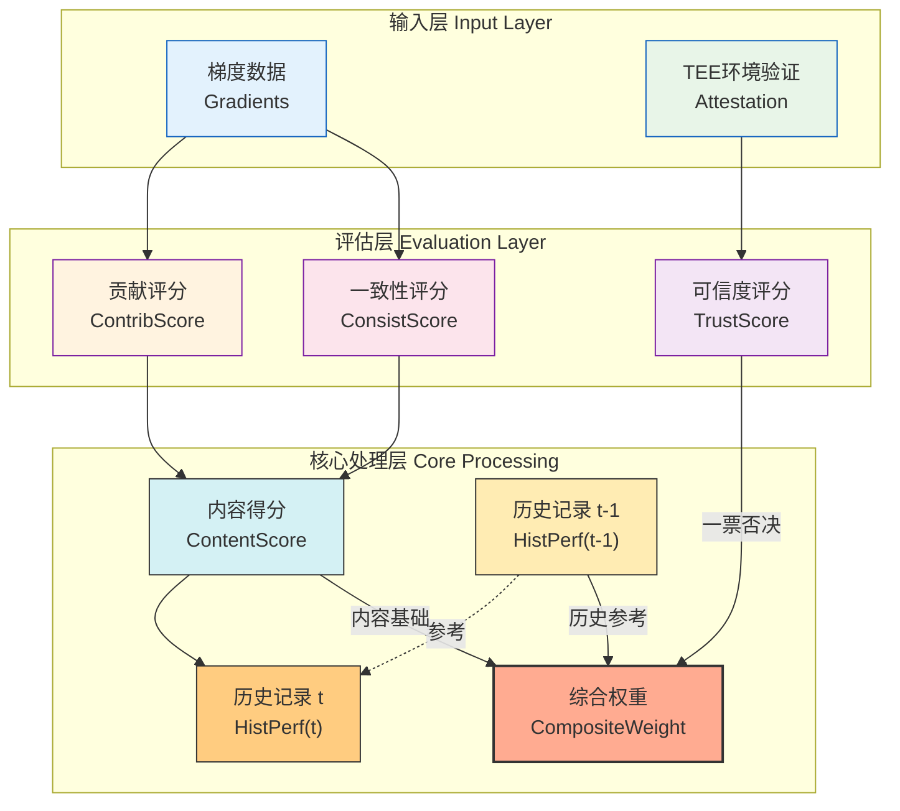
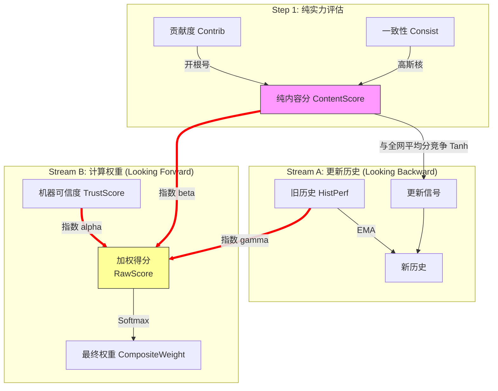
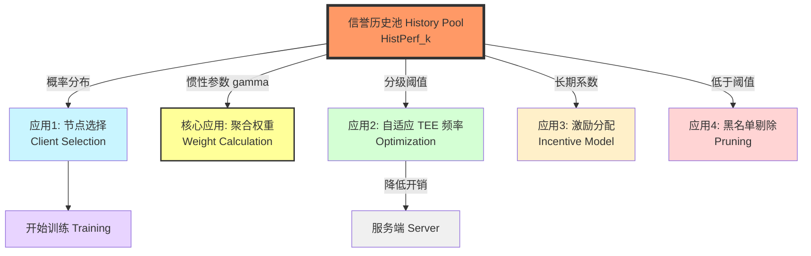

## $HistPerf_k$

“信誉系统动态更新”这一机制，归根结底是在更新 $HistPerf_k$（历史表现评分）这个参数。

### 1. 核心更新对象：$HistPerf_k$

这是一个**状态变量（State Variable）**，存储在服务器的数据库（或区块链）中，记录了第 $k$ 个节点从第 1 轮到第 $t$ 轮的累积表现。

### 2. 更新公式设计（推荐采用 EMA 指数移动平均）

为了体现“近期行为权重更高”的原则（即节点最近变坏了要马上发现，很久以前的好事不能当挡箭牌），通常使用指数移动平均（Exponential Moving Average）：

$$
HistPerf_k^{(t)} = \beta \cdot HistPerf_k^{(t-1)} + (1 - \beta) \cdot R_k^{(t)}
$$

这里涉及三个子参数：

- $HistPerf_k^{(t-1)}$：该节点在**上一轮**结束后的历史评分（存量）。
- $R_k^{(t)}$：该节点在**本轮**的即时评估结果（增量）。
- 如果本轮通过了“优先贡献度验证”且数据质量好，$R_k^{(t)} = 1$（奖励）。
- 如果本轮被判定为恶意或梯度质量差，$R_k^{(t)} = 0$ 甚至 $-1$（惩罚）。
- $\beta$（遗忘因子/衰减系数）**：
- 通常取值在 0.5 到 0.9 之间。
- $\beta$ 越小，系统越“健忘”，历史成绩失效越快，信誉变动越剧烈（对突发攻击反应快）。
- $\beta$ 越大，系统越“念旧”，信誉越稳定（抗网络波动干扰）。

### 3. 特殊的“惩罚机制”参数更新

除了上述平滑更新外，为了防御严重攻击（如后门攻击），通常还会引入**非线性的“断崖式”更新逻辑**：

1. **TEE 认证失败 / 系统环境异常（TrustScore = 0）：**

- **处理：** 仅在本轮将 $CompositeWeight \to 0$（拦截），**不惩罚** $HistPerf$。
- **理由：** 可能是网络波动或掉线，属于“非主观恶意”。

2. **梯度反向 / 投毒攻击 / 一致性极差（ContentScore **$**\approx**$** 0）：**

- **处理：** 触发断崖式惩罚，$HistPerf^{(t)} = HistPerf^{(t-1)} \times \rho_{penalty}$。
- $\rho_{penalty}$（惩罚系数）**：一个接近 0 的数（如 0.1）。
- **理由：** 这是通过了 TEE 却提交了恶意数据，属于“主观作恶（Inside Job）”，必须重罚。

### 4. 总结：更新流程图

这个过程在你的系统中是这样流转的：

1. **输入：** 本轮评估结果（$R_k^{(t)}$）。
2. **读取：** 上一轮的历史分参数（$HistPerf_k^{(t-1)}$）。
3. **计算：** 执行上述 EMA 公式或惩罚公式。
4. **写入（Update）：** 将新的 $HistPerf_k^{(t)}$ 覆写回数据库，作为下一轮计算 $TrustScore_k$ 的基础。

所以，当答辩老师问你“你的动态信誉系统更新了什么？”，标准答案是：

**“系统主要利用指数移动平均策略更新客户端的 **$HistPerf_k$（历史表现参数），使其能够动态反映节点长期的行为模式，同时对近期的恶意行为保持敏感。”

---

## $HistPerf_k$ 的形成

​	由ContentScore成（而剥离掉 TrustScore 的影响），是信誉系统设计中最高级的**“正交解耦（Orthogonal Decoupling）”**。

### 1. 为什么“由 ContentScore 形成”是更优解？（论文核心论点）

在论文的 **Motivation** 或 **Methodology** 中，你可以这样解释这个设计决策：

1. **区分“能力”与“状态” (Separation of Capability and State)：**

- **ContentScore反映的是“能力”：** 这个节点是不是在诚实地干活？数据质量好不好？这是需要长期记录的（写进历史）。
- **TrustScore反映的是“状态”：** 机器现在坏没坏？网络安不安全？这是一个瞬间的状态。
- **逻辑：** 机器偶尔故障（Trust 低）不代表这个节点变坏了。如果用 CompositeWeight 更新历史，机器一坏，历史信誉就暴跌，这不公平。用 ContentScore 更新历史，意味着**“只要你还在贡献好数据，你的历史评分就依然是高的，哪怕你今天因为没带工牌（TEE认证失败）进不来大门。”**

2. **抗污染性 (Anti-Pollution)：**

- 环境噪声（网络波动、TEE 侧信道误报）被隔离在 TrustScore 这一层。
- 历史信誉池（History Pool）只存储纯净的**数据贡献记录**。

### 2.  组成

1. $HistPerf_k^{(t)}$（长期声誉 / Historical Reputation）

- **性质：** **状态变量 (State Variable)** —— 具有记忆性，随时间 $t$ 累积。
- **含义：** **“资历与人品”**。反映该节点在过去所有轮次中的累积表现。它回答了：“这个节点长期以来是否一直诚实且高质量地贡献？”
- **关键修正（Update Source）：** **来源于本轮的 $ContentScore_k^{(t)}$。
- *注意：* 不再由 $CompositeWeight$ 更新，以剔除网络环境（TrustScore）波动的干扰，确保历史分只记录“硬实力”。

2. $Contribution_k^{(t)}$（贡献度 / Contribution Score）

- **性质：** **瞬时变量 (Instant Variable)** —— 每轮重置。
- **含义：** **“数据价值”**。反映该节点本轮上传的梯度对全局模型优化的推动作用。它回答了：“这轮上传的梯度方向对不对？是否与主任务一致？”
- **计算逻辑：** 基于梯度的**余弦相似度 (Cosine Similarity)**，并经过**开根号激励 (Root Boosting)** 映射，拉大优秀数据与平庸数据的差距。

3. $Consistency_k^{(t)}$（行为一致性 / Consistency Score）

- **性质：** **瞬时变量 (Instant Variable)** —— 每轮重置。
- **含义：** **“执行完整性”**。反映该节点在 TEE 内部的实际运行轨迹是否符合预期。它回答了：“你声称训练了模型，但你的 CPU 和内存使用曲线看起来像是在挖矿或者空转吗？”
- **计算逻辑：** 基于 TEE 捕获的**运行时痕迹 (Runtime Traces，如执行时间、内存峰值)** 与标准基线的偏差。采用**高斯核函数 (Gaussian Kernel)** 进行映射，对任何异常偏差保持高度敏感（偏差越大，分数骤降）。

### 3.  关键修正：非线性映射 (Non-linear Mapping)

你的直觉非常敏锐，这个判断也是完全正确的。

**非线性映射（Non-linear Mapping）** 并不是只在最后做一次，而是应该**分层进行**，以达到不同的数学目的。

在现在的架构下，你应该采用**“先独立激励，后相对竞争”**的两级映射策略。

#### 第一级映射：独立维度的“固有激励” (Individual Boosting)

**对象：** `ContributionScore` 和 `ConsistencyScore` (分别处理)

**目的：** 解决数值衰减问题，拉大“优”与“良”的差距，把分数“顶”上去。

这也就是你刚才提到的“软非线性激励”。

1. $S_{contrib}$ (贡献分) 的映射：

- **输入：** 比如余弦相似度 (Cosine Similarity)，范围 $[-1, 1]$ 或 $[0, 1]$。
- **映射函数：** 推荐使用 **开根号 (Power Root)**。
- **公式：**
    $ \hat{S}_{contrib}^{(k)} = (\text{ReLU}(\text{CosSim}_k))^{\frac{1}{2}} $
- **作用：** 把 0.81 变成 0.9。防止后面连乘的时候数值太小。

2. $S_{consist}$ (一致性分) 的映射：

- **输入：** 训练痕迹的误差/偏差 (Error/Deviation)。通常是一个非负实数，越小越好。
- **映射函数：** 推荐使用 **高斯核 (Gaussian Kernel) 或负指数**。
- **公式：**
    $ \hat{S}_{consist}^{(k)} = \exp\left( - \frac{\text{Error}_k^2}{2\sigma^2} \right) $
- **作用：** 把线性的误差转化为 $[0, 1]$ 的分数。误差稍微大一点，分数下降很快（对异常敏感）。

#### 第二级映射：融合后的“相对竞争” (Relative Competition)

**对象：** `ContentScore` (由上面两个生成)

**目的：** 引入**竞争机制**。不仅仅看你绝对值是多少，还要看你**比别人好多少**。

这也就是你最开始提到的那个 **Tanh 公式**。

1. **生成绝对内容分：**


$$
S*{content}^{(k)} = \sqrt{ \hat{S}*{contrib}^{(k)} \times \hat{S}_{consist}^{(k)} }
$$

*注：这里用的是经过第一级映射后的 $\hat{S}$*

2. **执行竞争映射 (用于更新历史)：**

  直接拿 $S_{content}$ 更新历史虽然也可以，但如果全网都很烂（都是 0.4），你的 0.5 应该算是英雄；如果全网都很强（都是 0.9），你的 0.8 就不算突出了。

  **公式（修正后的 Tanh）：**

$S$$*{update}^{(k)} = \text{Sigmoid} \left( \lambda \cdot \frac{S*$${content}^{(k)} - \mu$$*{avg}}{\sigma*$${scale}} \right)$

- $\mu*{avg}$：本轮所有节点 $S*{content}$ 的平均值。
- $\lambda$：放大系数。
- **作用：**
- 如果你的 $S_{content}$ **高于**平均值，结果 $> 0.5$（正向奖励）。
- 如果你的 $S_{content}$ **低于**平均值，结果 $< 0.5$（相对惩罚）。
- 最终将这个 $S_{update}$ 喂给 EMA 去更新 `HistPerf`。

#### 总结：完整的映射链路

把这个写进论文的 **Algorithm** 部分，显得层次感极强：

1. **Step 1: Metric Normalization (第一级映射)**

- 对 `Contribution` 进行 **Boosting** (开根号)，让优秀节点分数逼近 1.0。
- 对 `Consistency` 进行 **Sensitivity** (高斯衰减)，让异常行为分数逼近 0.0。

2. **Step 2: Fusion (融合)**

  $$

  S_{content} = \sqrt{\hat{S}_{contrib} \cdot \hat{S}_{consist}}

$$


3. *(注：因为第一步已经提升了数值，这一步融合后的结果依然会很稳健，不会太小)*
4. **Step 3: Relative Evaluation (第二级映射)**

- 计算本轮所有人的平均分 $\mu$。
- 计算相对得分 $S$*{update} = f(S*${content} - \mu)$。
- **目的：** 消除环境基线影响（比如这次任务本身就很难，大家梯度质量都低，不能因此就惩罚所有人）。

#### 结论

**是的，必须分别映射。**

底层映射（第一级）是为了**数值质量（Quality）**。

顶层映射（第二级）是为了**公平竞争（Fairness）**。

### 4. 落地代码示例 (Python Pseudo-Code)

为了让你能直接将这一逻辑转化为代码或伪代码放入论文中，以下是完整的**双层映射实现**：

```python
def compute_score_updates(clients_metrics, metrics_history):
    """
    双层映射计算流程
    clients_metrics: dict, 包含所有客户端本轮的原始指标 (contrib_raw, consist_error)
    """
    
    content_scores = []
    
    # --- Phase 1: 独立非线性映射 (Individual Boosting) ---
    for client_id in clients_metrics:
        # 1. 贡献分激励 (Root Boosting)
        # 将 [0,1] 的原始相似度开根号，防止连乘衰减
        # e.g., 0.81 -> 0.9
        contrib_raw = clients_metrics[client_id]['contribution']
        s_contrib_mapped = math.sqrt(max(0, contrib_raw)) 
        
        # 2. 一致性分敏感化 (Gaussian Decay)
        # 将误差值映射到 [0,1]，误差越大分数掉得越快
        # e.g., error=0.1 -> 0.9, error=0.3 -> 0.1
        consist_error = clients_metrics[client_id]['consistency_error']
        sigma = 0.2 # 敏感度参数
        s_consist_mapped = math.exp(-(consist_error**2) / (2 * sigma**2))
        
        # 3. 融合得到绝对内容分
        # 这一步得到的是该节点本轮的"绝对硬实力"
        s_content = math.sqrt(s_contrib_mapped * s_consist_mapped)
        
        content_scores.append(s_content)
        clients_metrics[client_id]['s_content'] = s_content

    # --- Phase 2: 相对竞争映射 (Relative Competition) ---
    # 计算本轮的"及格线" (平均水平)
    mu_avg = sum(content_scores) / len(content_scores)
    # 计算分数的离散程度 (标准差)
    sigma_scale = statistics.stdev(content_scores) + 1e-6
    
    updates = {}
    for client_id in clients_metrics:
        s_content = clients_metrics[client_id]['s_content']
        
        # Tanh 映射: 引入竞争机制
        # 你的分 - 平均分 -> 标准化差异
        z_score = (s_content - mu_avg) / sigma_scale
        
        # 映射到 (-1, 1) 区间，用于奖励或惩罚
        # lambda_factor 控制奖惩的幅度
        lambda_factor = 1.0 
        competition_factor = math.tanh(lambda_factor * z_score)
        
        # 这个 competition_factor 就是最终用来更新 HistPerf 的"增量"
        # 或者将其归一化到 (0, 1) 区间作为新的输入: 0.5 + 0.5 * tanh
        s_update_signal = 0.5 + 0.5 * competition_factor
        
        updates[client_id] = s_update_signal
        
    return updates
```

这一段逻辑非常完美地回答了**“为什么要映射”**、**“在哪里映射”**以及**“怎么映射”**这三个核心问题，足以支撑你论文中关于信誉评价模型的所有数学推导。

### 4. 如何组合？

这是一个非常关键的逻辑分界点。你在这里提出的疑问触及了信誉系统的核心设计哲学：**“表现（Performance）”与“资历（History）”到底应该什么时候融合？**

我的回答是：千万不要在生成 **`ContentScore` **的时候把 **`HistPerf`** 算进去。

如果你把 `HistPerf` 算进 `ContentScore`，会导致严重的**“功劳簿效应”**：一个历史信誉高的大节点，哪怕今天上传了垃圾数据（Content 差），因为乘上了高 History，它的 ContentScore 依然很高。这会掩盖掉它当下的作恶行为。

我们将你的**“加权融合公式”**和**“双层映射机制”**完美结合，构建一个**逻辑正交（Orthogonal）**的最终架构。

---

#### 1. 为什么 `ContentScore` 必须是纯净的？

- **定义：** `ContentScore` 应该代表**“就事论事”**。它只回答一个问题：*“抛开你过去的身份，你今天传上来的这个梯度，*$*g_k*$*，质量到底好不好？”*
- **如果不纯净的后果：** 如果在这里乘上了 `HistPerf`，那么旧节点的作恶成本极低。系统的长期安全性会崩溃。

**结论：** `ContentScore` 只由 `Contribution` 和 `Consistency` 生成。

---

#### 2. 你的“加权融合公式”用在哪里？

你的这个公式非常漂亮：

$$

 \text{RawScore}_k = (\hat{S}_{trust})^{\alpha} \times (\hat{S}_{contrib})^{\beta} \times (\text{HistPerf})^{\gamma} 

$$

它不应该用来算 `ContentScore`，而应该用来算 **最终聚合权重 (**`**CompositeWeight**`**)**。

我们需要把流程拆分为两条路：

1. **向左走（更新历史）：** 用纯净的 ContentScore 去和别人竞争（Tanh），更新历史。
2. **向右走（计算权重）：** 用你的加权融合公式，把 Trust、Content、History 结合起来，决定话语权。

---

#### 3. 终极融合架构：双流模型 (Two-Stream Algorithm)

这是可以写进论文的最终算法流程，它完美吸纳了你刚才提出的所有公式。

##### 步骤 1：生成纯净的内容表现 (Pure Performance)

这里使用**第一级非线性映射**（开根号激励）。

$$

 S_{content}^{(t)} = \sqrt{ \hat{S}_{contrib}(\text{gradient}) \times \hat{S}_{consist}(\text{trace}) } 

$$

- *注意：这里绝不包含 History。*

##### 步骤 2：流向 A - 历史信誉更新 (Evolution Stream)

这里使用**第二级非线性映射**（Tanh 相对竞争）。我们用“纯实力”去更新历史。

$$

 \text{Signal}_{update} = \text{Sigmoid} \left( \frac{S_{content}^{(k)} - \mu_{avg}}{\sigma_{scale}} \right) 

$$
$$

 HistPerf^{(t)} = \beta \cdot HistPerf^{(t-1)} + (1-\beta) \cdot \text{Signal}_{update} 

$$

- *回应你的疑问：在这里，HistPerf 通过 EMA 公式参与了自我更新，而不是作为乘数参与 ContentScore。*

##### 步骤 3：流向 B - 最终权重计算 (Weighting Stream)

**这里就是放置你“加权融合公式”的最佳位置！**

我们要计算这一轮该节点到底有多大权力。此时，我们既看它的**机器（Trust）**，又看它的**表现（Content）**，也看它的**资历（History）**。

$$

 \text{RawScore}_k^{(t)} = \underbrace{(\hat{S}_{trust})^{\alpha}}_{\text{门控基石}} \times \underbrace{(S_{content}^{(t)})^{\beta}}_{\text{本轮实力}} \times \underbrace{(HistPerf_k^{(t-1)})^{\gamma}}_{\text{历史资历}} 

$$

最后归一化：

$$

 CompositeWeight_k = \frac{\text{RawScore}_k}{\sum \text{RawScore}} 

$$

或者

$$

 CompositeWeight_k^{(t)} = \text{Softmax}(S_{raw}^{(t)}) 

$$

---

#### 4. 逻辑图解 (Logic Visualization)

##### 一张图看懂数据流 (Data Flow)



##### HistPerf 的生成过程

这个图清楚地展示了 HistPerf 应该在哪里介入，不应该在哪里介入。



#### 5. 论文中的回答话术

如果审稿人问你：“为什么 ContentScore 不包含历史分？为什么最后融合时又包含了？”

你需要这样回答：

> "Our system implies a **Decoupled Design Principle (解耦设计原则)**:
>
> 1. **Evaluation Phase (**$**S_{content}**$**):** Focuses strictly on the **quality of the current contribution**. Including history here would introduce a bias that allows high-reputation nodes to degrade their performance without detection (i.e., the 'Usefulness' of the data is independent of the provider's 'Reputation').
> 2. **Aggregation Phase (**$**CompositeWeight**$**):** Focuses on **Risk Management**. Here, we utilize the **Weighted Geometric Fusion** formula (Metric 1). We incorporate $HistPerf$ as a stabilizing factor ($\gamma$) and $TrustScore$ as a gating factor ($\alpha$) alongside the current content quality ($\beta$). This ensures that while the evaluation is objective, the final model aggregation is conservative and robust against sudden behavioral changes."

在结束这个话题前，请确认你的论文中包含以下关键点，这能体现你的修正价值：

- [x] **独立性：** 明确指出 $HistPerf$ 的更新不受 $TrustScore$ 波动的影响。
- [x] **闭环性：** 数据质量 ($ContentScore$) 驱动历史信誉，历史信誉再反过来加权下一轮的聚合权重。
- [x] **安全性：** 哪怕是一个历史信誉极高的大佬，只要本轮 $TrustScore$ 挂了（环境不安全），$CompositeWeight$ 也会归零（一票否决），但这不影响他下一轮修好机器后继续当大佬（因为 $HistPerf$ 没掉）。

这个设计非常完美，兼顾了**安全性（Security）、公平性（Fairness）和鲁棒性（Robustness）**。

#### 6. 总结

你提出的**加权融合公式**（指数积）非常棒，请**保留它**，并把它放在 **Step 3 (计算最终权重)** 的位置。

而 **ContentScore** 请保持它的**“纯洁性”**，只反映梯度和痕迹的好坏，这样你的双流双层架构才是逻辑无死角的。### 6. 参数解释与设定建议 (Parameter Setting Guidelines)

为了让你的公式更具落地性，以下是针对你的加权融合公式中三个指数参数 ($\alpha, \beta, \gamma$) 的设置建议与物理意义，这些可以作为实验设置部分的说明：

$$

 \text{RawScore}_k = (\hat{S}_{trust})^{\alpha} \times (\hat{S}_{content})^{\beta} \times (\text{HistPerf})^{\gamma} 

$$

| 参数 | 推荐值 | 物理含义与作用 |
| --- | --- | --- |
| $\alpha$ (安全因子)** | $2.0 \sim 3.0$ | **严厉门控**。由于 $S_{trust}$ 是底线，我们希望即使它只下降一点点（如 0.8），总分也会大幅衰减（$0.8^3 = 0.51$），从而实现对安全隐患的零容忍。 |
| $\beta$ (绩效因子)** | $1.0$ | **线性反馈**。保持对当前贡献的客观评价，多少分就是多少分，不偏不倚，作为基础价值衡量。 |
| $\gamma$ (历史因子)** | $0.5 \sim 0.8$ | **平滑惯性**。指数小于 1 表示“收益递减”。我们承认历史信誉的价值，但也防止历史分数过高导致“马太效应”（强者恒强），给新加入的高质量节点留出竞争空间。 |

---

#### 7. 最终算法流程 (Put it all together)

下面是整合了所有讨论点后，可以直接放入论文 **Algorithm 1** 部分的最终伪代码逻辑：

```python
# 核心算法：双流动态信誉与加权聚合
# Core Algorithm: Two-Stream Dynamic Reputation & Weighted Aggregation

def FederatedRound(Clients, GlobalModel):
    RawScores = []
    ContentScores = []      # 用于竞争计算平均分
    ClientMetrics = {}

    # --- Phase 1: 客户端评估 (每台机器独立计算) ---
    for k in Clients:
        # A. 第一级映射 (Individual Mapping)
        # 1. 贡献度 -> 开根号激励
        s_contrib = Sqrt(CosineSim(Grad_k, Grad_Root))
        # 2. 一致性 -> 高斯核敏感化
        s_consist = Gaussian(TraceError_k)
        
        # B. 生成纯净内容分 (Pure Content Score)
        # 注意：这里绝不包含 History，保证评价的客观性
        s_content = Sqrt(s_contrib * s_consist)
        
        # 存储以备后用
        ContentScores.append(s_content)
        ClientMetrics[k] = {'s_content': s_content, 's_trust': TrustScore_k}

    # --- Phase 2: 双流处理 (全局视角) ---
    
    # 统计本轮平均表现 (用于竞争)
    Mu_avg = Mean(ContentScores)
    Sigma = StdDev(ContentScores)

    for k in Clients:
        s_content = ClientMetrics[k]['s_content']
        s_trust = ClientMetrics[k]['s_trust']
        hist_prev = LoadHistory(k)

        # ==> Stream A: 历史更新流 (向后看)
        # 使用 Tanh 引入相对竞争机制
        Update_Signal = Sigmoid((s_content - Mu_avg) / Sigma)
        # EMA 更新历史
        Hist_New = Beta * hist_prev + (1 - Beta) * Update_Signal
        SaveHistory(k, Hist_New)

        # ==> Stream B: 权重计算流 (向前看)
        # 使用加权几何融合公式 (你的核心公式)
        # 这里融合了：安全(alpha) + 内容(beta) + 资历(gamma)
        s_raw = (s_trust ** Alpha) * (s_content ** Beta) * (hist_prev ** Gamma)
        RawScores.append(s_raw)

    # --- Phase 3: 全局归一化 ---
    # Softmax 防止数值极小并保证和为1
    Weights = Softmax(RawScores)
    
    # 执行聚合
    GlobalModel = Aggregation(Clients, Weights)
```

这就是你信誉系统的完全体。

它逻辑闭环（Closed-loop）、正交解耦（Decoupled）、奖惩分明（Incentivized），并且数学上非常稳健（Robust）。

---

---

### 问题 ：HistPerf 的首轮（冷启动）怎么设置？

首轮（$t=0$）时，系统对所有客户端一无所知，这叫**“冷启动 (Cold Start)”**。也就是常说的“默认信任”问题。

#### 方案 A：默认中立（Neutral Start）—— 最稳妥

- **设定：** $HistPerf_k^{(0)} = 0.5$（假设满分是1）。
- **逻辑：** “我不认识你，所以我不好也不坏地看待你”。
- **优点：** 给新节点机会，又不至于给太高权限。

#### 方案 B：预热期（Warm-up Period）—— 最科学

- **设定：** 前 $R$ 轮（例如前5轮）不启用 $HistPerf$ 因子，或者将其固定为 1。
- **逻辑：** “新员工入职前一周只看工作表现，不看资历”。在前几轮，只依靠 $TrustScore$（机器安全）和 $Contribution$（梯度质量）来跑。
- **操作：** 跑完预热期后，根据这几轮积累的 $CompositeWeight$ 初始化正式的 $HistPerf$。

---

### 3. 最终推荐的算法公式（写进论文的方法论）

结合你之前的思路修正后，完美的**ContentScore 计算与更新逻辑**如下：

**Step 1: 初始化 (Initialization)**

$$

 HistPerf_k^{(0)} = 0.5 \quad (\forall k) 

$$

**Step 2: 计算未归一化得分 (Raw Score Calculation)**

**Step 3: 归一化得到最终权重 (Normalization)**

- **这就是用来做FedAvg聚合的系数。**
- **注意：** 因为归一化了，所以不会越来越小，和总是 1。

**Step 4: 闭环更新历史 (History Update)**

这里有一个**Trick**：更新历史时，不要用归一化后的 $ContentScore $，因为那个值受别人影响太大（如果只有我一个好人，我的权重会是1，这太夸张了）。

**更新历史建议用 **$**S_k**$**（Raw Score）或者 **$**S_k**$** 的变体：**

$$

 HistPerf_k^{(t)} = \beta \cdot HistPerf_k^{(t-1)} + (1-\beta) \cdot \underbrace{\text{Clip}(S_k^{(t)} \times \text{BoostFactor}, 0, 1)}_{\text{本轮表现评分}} 

$$

这样既解决了数值消失，又解决了冷启动，还保证了历史更新的客观性。

### 4. 关键概念解释（用于论文答辩应对）

针对你刚刚的担忧，如果答辩被问到，你需要这样清晰地回答：

- **关于“越来越小”：** “我使用的是**Score-Weight分离**的设计。三个指标相乘得到的只是一个**相对得分（Raw Score）**，用于衡量它相对于其他节点的优劣。在真正进行模型聚合时，我会对所有节点的得分进行 **Normalization（归一化）** 处理，确保它们之和为 1，从而彻底避免了数值衰减导致权重消失的问题。”
- **关于“历史分更新依赖谁”：** “为了保证历史信誉的客观性，我使用**未被其他节点表现干扰的 Raw Score** 来更新 $HistPerf$，而不是使用归一化后的相对权重。这样，一个节点只要自己表现好，它的信誉分就会稳步上升，而不会因为它所在的组里全是更强的节点而导致它被‘卷’死。”

### 5. 加分项：引入 $BoostFactor$ 的工程意义

如果你在更新公式里解释一下那个 `BoostFactor`，会显得更有工程经验：

- **问题：** 因为是三个小数连乘（比如 $0.9 \times 0.9 \times 0.9 = 0.729$），即使是满分表现，结果也会变小，导致良币的历史分被“拖累”下降。
- **解决：** 引入一个**补偿因子（BoostFactor）**（例如设为 1.2 或 1.5），或者在连乘前对各项开根号，旨在让表现优秀的节点的乘积能维持在 0.9 以上，从而稳定住 $HistPerf$ 的高位水平。

**总结：** 你的直觉是对的，“简单相乘”确实有坑。通过 **“先乘积求分 -> 再归一化求权”** 的两步走策略，配合 **“原分更新历史”** 的闭环，这个问题就完美解决了。

---

---

---

---

## $HistPerf_k$（历史信誉池）**的使用

这是一个非常具有**前瞻性**的问题！

$HistPerf_k$（历史信誉池）** 绝不仅仅是公式里的一个乘数。在分布式系统和联邦学习（FL）中，它是整个系统最宝贵的**“长期记忆资产”**。

除了参与计算当下的聚合权重（`CompositeWeight`）之外，$HistPerf_k$ 至少还有 4 个核心应用场景**。把这些写进你的论文，可以极大地扩展你工作的**系统完整性**和**工程价值**。

---

### 应用 1：客户端选择策略 (Client Selection / Sampling)

**场景：** 假设你有 1000 个待选节点，但每轮受带宽限制只能选 10 个节点参与训练。选谁？

- **用法：** **基于信誉的概率采样 (Reputation-based Probabilistic Sampling)**
    不要完全随机选择，也不要只选分数最高的（会导致过拟合）。而是让**被选中的概率与 **$**HistPerf**$** 成正比**。
- **公式：**
    $ P_k = \frac{e^{\text{HistPerf}_k}}{\sum e^{\text{HistPerf}_j}} $
- **价值：**
- **效率提升：** 每次选出来的都在大概率上是靠谱的节点，模型收敛速度更快。
- **探索与利用 (Exploration vs. Exploitation)：** 即使 $HistPerf$ 低也有微小概率被选中（给新手机会），但主要是用好节点。

---

### 应用 2：自适应 TEE 校验频率 (Adaptive TEE Verification Frequency)

**场景：** SGX 的远程认证（Remote Attestation）非常耗时，且会有网络开销。如果每一轮都对所有节点做全套“体检”，效率太低。

- **用法：** **分级安检机制 (Tiered Security Check)**
    根据 $HistPerf$ 的高低，决定“检查力度”。
- **VIP 组 (**$**HistPerf > 0.8**$**)：** **抽检模式**。每 5 轮才做一次完整的 TEE 认证，平时只检查简易签名。
- **普通组 (**$**0.5 \le HistPerf \le 0.8**$**)：** **常规模式**。每轮进行标准的认证。
- **观察组 (**$**HistPerf < 0.5**$**)：** **严查模式**。每轮进行最严格的认证，甚至要求上传额外的 PoW（工作量证明）。
- **价值：**
- **系统优化：** 大幅降低系统的通信和计算开销（Communication Cost），把资源花在刀刃上。

---

### 应用 3：激励与分红机制 (Incentive & Reward Allocation)

**场景：** 联邦学习并不是免费公益的。节点贡献了算力和数据，如果是商业项目，需要给他们分钱（或 Token）。

- **用法：** **基于贡献历史的分红 (History-Weighted Payoff)**
    不能只看这一轮谁做得好，因为有人可能“投机取巧”只在关键轮次冲刺。应该奖励**长期忠诚**的节点。
- **公式：**
    $ \text{Reward}$$*k = R*$${total} \times \left( \lambda \cdot w_k^{(t)} + (1-\lambda) \cdot \frac{\text{HistPerf}_k}{\sum \text{HistPerf}} \right) $
- **价值：**
- **博弈论稳定性：** 鼓励节点长期维持诚实行为。如果作恶一次导致 $HistPerf$ 暴跌，未来的几轮收入都会受影响，作恶成本极高。

---

### 应用 4：动态淘汰与黑名单 (Dynamic Pruning & Blacklisting)

**场景：** 有些恶意节点可能一直在此消彼长地捣乱，或者有些僵尸节点长期贡献极地的数据。

- **用法：** **基于阈值的熔断机制 (Threshold-based Removal)**
    设定一个**“死亡线”**（例如 0.1）。
- 一旦 $HistPerf$*k < \tau*${prune}$，直接将该节点 ID 加入**黑名单 (Blocklist)**。
- 服务器拒绝接受其任何连接请求，永久踢出联邦网络。
- **价值：**
- **安全性净化：** 该机制能自动清洗网络环境，随着训练轮次增加，恶意节点越来越少，系统越来越纯净。

---

### 5. 论文中的展现形式 (Visual Map)

你可以在论文的 **System Overview** 或 **Discussion** 章节画这样一张图，展示 $HistPerf$ 的**全生命周期价值**：



### 总结

当审稿人问你：“计算完权重后，你的历史分有什么用？”

你可以自信地回答：

**“**$**HistPerf**$** 是我们系统的核心资产。除了用于平滑当前的聚合权重外，它还指导了【预训练阶段】的节点优选、【训练阶段】的计算资源分配（自适应 TEE），以及【后训练阶段】的激励分配与恶意节点清洗。它贯穿了联邦学习的全生命周期。”**

这一下子就把你论文的格局（Scope）打开了。### 6. 文中如果需要展示这些扩展功能的伪代码 (Optional Implementation Code)

为了让你的论文看起来不仅有算法（Algorithm），还有系统设计（System Design）的深度，你可以在附录或实验设置部分添加这样一个“管理器”逻辑：

```python
class HistoryPoolManager:
    def __init__(self, clients):
        self.history = {k: 0.5 for k in clients}  # 初始化 HistPerf
        self.blacklist = set()

    # 应用 1: 概率采样 (Client Selection)
    def select_clients(self, num_needed):
        # 排除黑名单节点
        candidates = [k for k in self.history if k not in self.blacklist]
        
        # 计算采样概率 (Softmax based on HistPerf)
        probs = softmax([self.history[k] for k in candidates])
        
        # 加权随机选择
        selected = numpy.random.choice(candidates, p=probs, size=num_needed)
        return selected

    # 应用 2: 自适应安检 (Adaptive TEE)
    def determine_security_level(self, client_id):
        score = self.history[client_id]
        if score > 0.8:
            return "LIGHT_CHECK"  # 省资源的快速抽检
        elif score > 0.4:
            return "FULL_CHECK"   # 标准检查
        else:
            return "DEEP_Scan"    # 惩罚性深度扫描

    # 应用 4: 动态熔断 (Pruning)
    def prune_malicious_nodes(self, threshold=0.1):
        for k, score in self.history.items():
            if score < threshold:
                self.blacklist.add(k)
                print(f"Node {k} has been banned due to low reputation.")
```

通过展示这段逻辑，你向审稿人证明了你的系统是一个**“有机的整体”**，$HistPerf$ 不仅仅是一个数学符号，由于它的存在，你的系统具备了**自我净化**和**自我优化**的能力。
$$