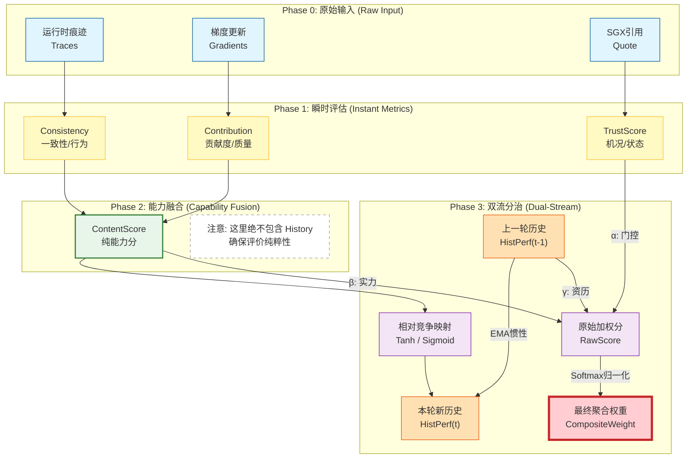

### 变量关系图谱 (以备查阅)

为了让你更清楚它们的关系，这里有一个简洁的逻辑总结：

1. $Contribution$ + $Consistency$ $\xrightarrow{\text{融合}}$ $ContentScore$ (纯能力)
2. $ContentScore$ $\xrightarrow{\text{EMA更新}}$ $HistPerf$ (新历史)
3. $Trust$ (机况) + $Content$ (能力) + $Hist$ (资历) $\xrightarrow{\text{加权}}$ $CompositeWeight$ (最终话语权)

这样修改后，定义准确且逻辑闭环。

### 4. 详细计算模型 (Formal Calculation Model)

基于上述核心变量定义，系统运行的数学计算逻辑构建如下：

#### A. 瞬时指标计算 (Instant Metrics Calculation)

- **贡献度** ($Contribution_k^{(t)}$):
  采用余弦相似度衡量梯度方向质量，并应用 ReLU 剔除负向优化：
  $$
   S*{contrib}^{(t)} = (\text{ReLU}(\cos(\mathbf{g}_k, \mathbf{g}*{global})))^{\frac{1}{2}} 
  $$
  *(注：*$\frac{1}{2}$ 次幂为非线性激励，用于提升数值水平，防止连乘衰减)*
- **一致性** ($Consistency_k^{(t)}$):
  采用高斯径向基函数（RBF）衡量运行时痕迹与基准的偏差：
  $$
   S_{consist}^{(t)} = \exp\left( - \frac{\| \mathbf{v}_{trace} - \mathbf{v}_{benchmark} \|^2}{2\sigma^2} \right) 
  $$
  *(注：对异常偏差高度敏感，偏差越大分数呈指数级下降)*

#### B. 能力融合 (Capability Fusion)

- **纯能力分** ($ContentScore_k^{(t)}$):
  综合两项瞬时指标，生成不含历史偏见的本轮能力评分：
  $$
   S*{content}^{(t)} = \sqrt{ S*{contrib}^{(t)} \times S_{consist}^{(t)} } 
  $$

#### C. 历史演进 (History Evolution)

- **竞争映射信号** ($\Delta_{signal}$):
  引入全网竞争机制，将绝对分数转化为相对表现：
  $$
   \Delta*{signal} = \text{Sigmoid}\left( \lambda \cdot \frac{S*{content}^{(t)} - \mu*{avg}}{\sigma*{scale}} \right) 
  $$
- **状态更新** ($HistPerf_k^{(t)}$):
  使用指数移动平均（EMA）更新历史信誉池：
  $$
   HistPerf*k^{(t)} = \beta \cdot HistPerf_k^{(t-1)} + (1-\beta) \cdot \Delta*{signal} 
  $$

#### D. 最终赋权 (Final Weighting)

- **原始加权分** ($RawScore_k^{(t)}$):
  综合可信状态、本轮能力与历史资历：
  $$
   RawScore*k = (TrustScore_k)^\alpha \cdot (S*{content}^{(t)})^\beta \cdot (HistPerf_k^{(t-1)})^\gamma 
  $$
- **归一化权重** ($CompositeWeight_k^{(t)}$):
  $$
   w*k^{(t)} = \frac{RawScore_k}{\sum*{j} RawScore_j} 
  $$

### 5. 算法流程总结 (Algorithm Summary)

整个动态更新过程遵循 **“双流评估，正交更新 (Dual-Stream Evaluation, Orthogonal Update)”** 原则：

1. **输入流 (Input Stream)**：系统接收客户端上传的 TEE 遥测数据（Traces）与模型更新（Gradients）。
2. **评估层 (Evaluation Layer)**：独立计算 $Contribution$ 与 $Consistency$，仅基于本轮数据融合生成纯净的 $ContentScore$。
3. **流向分治 (Stream Divergence)**：

- **流向 A (向后更新)**：$ContentScore$ 经由全网竞争映射（Tanh/Sigmoid）后，作为增量信号更新数据库中的 $HistPerf_k$（只看能力，不看环境）。
- **流向 B (向前决策)**：$ContentScore$ 与当前的机况 $TrustScore$ 以及刚读取的旧资历 $HistPerf_{old}$ 结合，计算本轮聚合权重 $CompositeWeight$。

4. **输出 (Output)**：同时输出新的全局模型（基于权重聚合）和更新后的信誉状态表。

