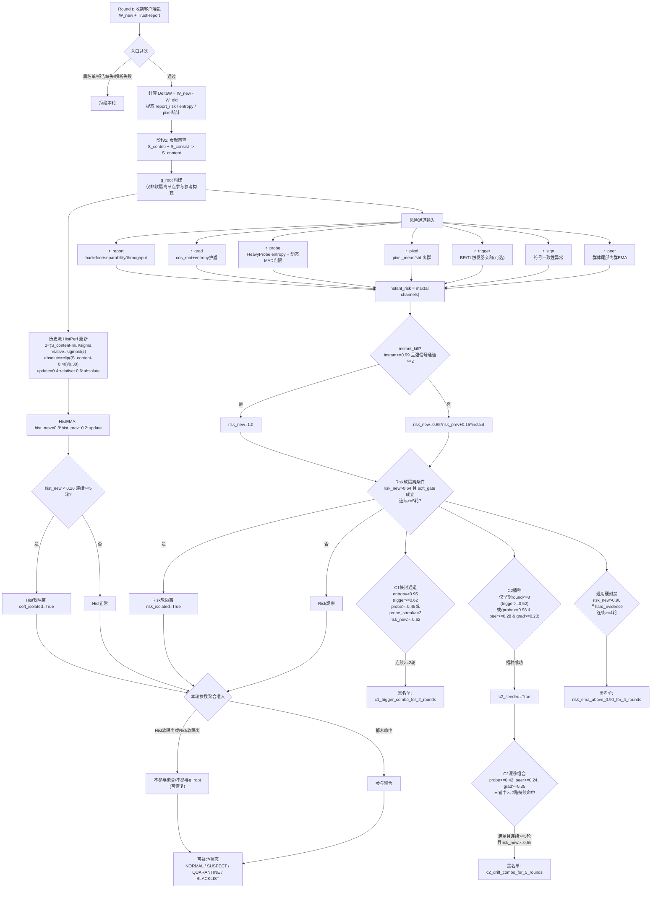
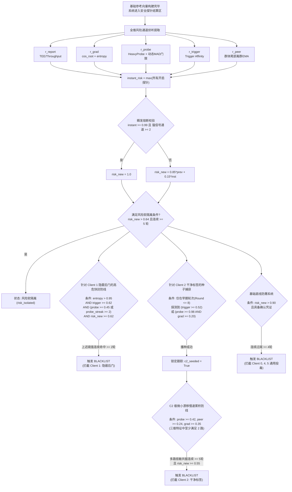

## 图1

```mermaid
flowchart TD
    A["Round t: 收到客户端包<br/>W_new + TrustReport"] --> B{入口过滤}
    B -->|黑名单/报告缺失/解析失败| X[拒绝本轮]
    B -->|通过| C["计算 DeltaW = W_new - W_old<br/>提取 report_risk / entropy / pixel统计"]

    C --> D["阶段2: 贡献审查<br/>S_contrib + S_consist -> S_content"]
    D --> E["g_root 构建<br/>仅非软隔离节点参与参考构建"]

    %% 历史流
    E --> H1["历史流 HistPerf 更新<br/>z=(S_content-mu)/sigma<br/>relative=sigmoid(z)<br/>absolute=clip((S_content-0.40)/0.30)<br/>update=0.4*relative+0.6*absolute"]
    H1 --> H2["HistEMA: hist_new=0.8*hist_prev+0.2*update"]
    H2 --> H3{hist_new < 0.26 连续>=5轮?}
    H3 -->|是| H4["Hist软隔离 soft_isolated=True"]
    H3 -->|否| H5[Hist正常]

    %% 风险流
    E --> R0[风险通道输入]
    R0 --> R1["r_report<br/>backdoor/separability/throughput"]
    R0 --> R2["r_grad<br/>cos_root+entropy护盾"]
    R0 --> R3["r_probe<br/>HeavyProbe entropy + 动态MAD门限"]
    R0 --> R4["r_pixel<br/>pixel_mean/std 离群"]
    R0 --> R5["r_trigger<br/>BR/TL触发器亲和(可选)"]
    R0 --> R6["r_sign<br/>符号一致性异常"]
    R0 --> R7["r_peer<br/>群体尾部离群EMA"]

    R1 --> R8
    R2 --> R8
    R3 --> R8
    R4 --> R8
    R5 --> R8
    R6 --> R8
    R7 --> R8
    R8["instant_risk = max(all channels)"] --> R9{"instant_kill?<br/>instant>=0.99 且强信号通道>=2"}
    R9 -->|是| R10["risk_new=1.0"]
    R9 -->|否| R11["risk_new=0.85*risk_prev+0.15*instant"]
    R10 --> R12
    R11 --> R12

    R12{"Risk软隔离条件<br/>risk_new>0.64 且 soft_gate 成立<br/>连续>=5轮?"}
    R12 -->|是| R13["Risk软隔离 risk_isolated=True"]
    R12 -->|否| R14[Risk观察]

    %% C1
    R12 --> C1A{"C1快封通道<br/>entropy>0.95<br/>trigger>=0.62<br/>probe>=0.45或probe_streak>=2<br/>risk_new>=0.62"}
    C1A -->|连续>=2轮| C1B[黑名单: c1_trigger_combo_for_2_rounds]

    %% C2
    R12 --> C2S{"C2播种<br/>仅早期round<=8<br/>(trigger>=0.52)<br/>或(probe>=0.98 & peer>=0.28 & grad>=0.20)"}
    C2S -->|播种成功| C2E["c2_seeded=True"]
    C2E --> C2A{"C2漂移组合<br/>probe>=0.42, peer>=0.24, grad>=0.35<br/>三者中>=2路持续命中"}
    C2A -->|满足且连续>=5轮<br/>且risk_new>=0.55| C2B[黑名单: c2_drift_combo_for_5_rounds]

    %% 通用硬封禁
    R12 --> RH{"通用硬封禁<br/>risk_new>0.90<br/>且hard_evidence<br/>连续>=4轮"}
    RH --> RHB[黑名单: risk_ema_above_0.90_for_4_rounds]

    %% 聚合准入
    H4 --> G
    H5 --> G
    R13 --> G
    R14 --> G
    G{"本轮参数聚合准入"}
    G -->|Hist软隔离或Risk软隔离| G1["不参与聚合/不参与g_root<br/>(可恢复)"]
    G -->|都未命中| G2[参与聚合]

    G1 --> S["可疑池状态<br/>NORMAL / SUSPECT / QUARANTINE / BLACKLIST"]
    G2 --> S
```

## 图2

```mermaid
flowchart TD
    %% 前置处理与基础阈值
    E["基础参考向量构建完毕<br/>系统进入安全探针结算区"] --> R0[全维风险通道侦听提取]
    R0 --> R1["r_report<br/>TEE/Throughput"]
    R0 --> R2["r_grad<br/>cos_root + entropy"]
    R0 --> R3["r_probe<br/>HeavyProbe + 动态MAD门限"]
    R0 --> R5["r_trigger<br/>Trigger Affinity"]
    R0 --> R7["r_peer<br/>群体尾部离群EMA"]

    R1 & R2 & R3 & R5 & R7 --> R8
    R8["instant_risk = max(所有开启探针)"] --> R9{"瞬发熔断校验<br/>instant >= 0.99 且 强信号通道 >= 2"}
    R9 -->|是| R10["risk_new = 1.0"]
    R9 -->|否| R11["risk_new = 0.85*prev + 0.15*inst"]
    
    R10 & R11 --> R12
    R12{"满足风险软隔离条件?<br/>risk_new > 0.64 且连续 >= 5 轮"}
    R12 -->|是| R13["状态: 风险软隔离 (risk_isolated)"]

    %% C1
    R12 --> C1A{"针对 Client 1 隐蔽后门的高危快封防线<br/><br/>条件: entropy > 0.95<br/>AND trigger >= 0.62<br/>AND (probe >= 0.45 或 probe_streak >= 2)<br/>AND risk_new >= 0.62"}
    C1A -->|上述阈值连续命中 >= 2轮| C1B["触发 BLACKLIST<br/>(拦截 Client 1: 隐蔽后门)"]

    %% C2
    R12 --> C2S{"针对 Client 2 干净标签的种子捕获<br/><br/>条件: 仅在早期轮次(Round <= 8)<br/>探测到 (trigger >= 0.52)<br/>或 (probe >= 0.98 AND grad >= 0.20)"}
    C2S -->|播种成功| C2E["锁定跟踪: c2_seeded = True"]
    
    C2E --> C2A{"C2 极微小漂移慢速累积防线<br/><br/>条件: probe >= 0.42, peer >= 0.24, grad >= 0.35<br/>(三维特征中至少满足 2 路)"}
    C2A -->|多路低敏共振连续 >= 5轮<br/>且 risk_new >= 0.55| C2B["触发 BLACKLIST<br/>(拦截 Client 2: 干净标签)"]

    %% 通用硬封禁
    R12 --> RH{"基础底线防爆系统<br/><br/>条件: risk_new > 0.90<br/>且具备确认凭证"}
    RH -->|连续过阈 >= 4轮| RHB["触发 BLACKLIST<br/>(拦截 Client 0, 4, 5 通用投毒)"]
```

