# 中期答辩PPT大纲（已确认）

Deck name: 中期答辩PPT
Source: `PaperWriting/main.tex`, `PaperWriting/main.pdf`, `PaperWriting/开题报告-周家凯.pptx`
Style reference: 使用开题报告模板的天津理工大学红白灰答辩风格作为基调；顶部标题栏、页眉细红线、正文区密度参考 `PaperWriting/中期答辩-段鑫.pptx`。模板预览仅作风格参考，不复用原模板内容。

## Slide 1: 封面
- Key points:
  - 题目：边缘计算中信任流驱动的可信联邦关键技术研究
  - 答辩人：周家凯
  - 导师：卜超
  - 场景定位：中期答辩，突出阶段性进展与后续计划
- Visual idea: 复刻模板封面气质，居中校名与题目，左右红/深灰竖向装饰块。
- Layout role and intent: cover; 建立学校模板一致性。
- Required images:
  - 模板封面风格参考；style-only reference; 不复用原文字内容。

    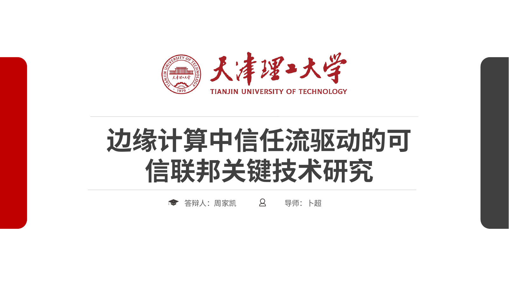

## Slide 2: 汇报目录
- Key points:
  - 研究背景与问题
  - 已完成研究内容
  - 阶段性实验结果
  - 后续计划与风险
- Visual idea: 保持模板目录页红色左栏与右侧图标列表，但将章节改为中期答辩结构。
- Layout role and intent: agenda; 帮助评委快速把握答辩节奏。
- Required images:
  - 模板目录风格参考；style-only reference。

    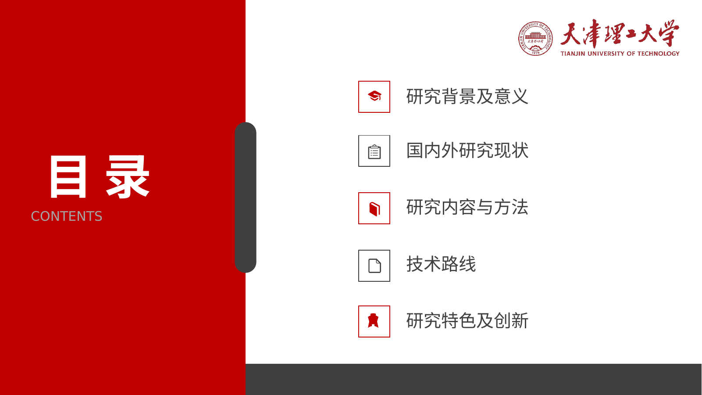

## Slide 3: 研究背景与核心矛盾
- Key points:
  - 联邦学习已成为边缘智能中隐私保护协同训练的重要范式。
  - 开放边缘环境叠加 Non-IID、设备异构和不可信客户端。
  - 仅依赖服务器端鲁棒聚合，难以覆盖从客户端准入到模型聚合的全流程风险。
  - 本研究关注“低误杀、高召回、可收敛”的可信联邦闭环。
- Visual idea: 左侧放系统交互图，右侧用三条风险链路解释问题来源。
- Layout role and intent: context / problem; 从应用背景自然引出研究必要性。
- Required images:
  - 系统交互架构；strict input asset; 保留图中层级、节点和箭头含义。

    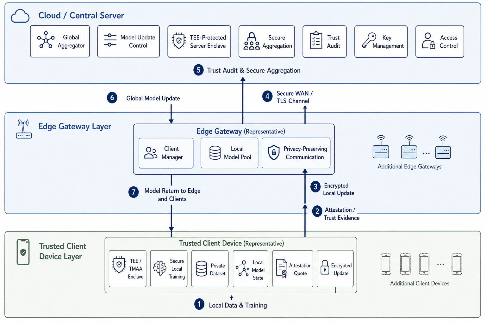

## Slide 4: 威胁模型与研究目标
- Key points:
  - 内部恶意客户端可执行标签翻转、后门、符号翻转、梯度缩放等攻击。
  - TEE 提供硬件信任根，但仍需与模型内容审查和跨轮信誉联动。
  - 设计目标：高防御效能、长尾合法节点包容、边缘侧轻量开销。
  - 主实验采用 20 客户端、30% 恶意比例，额外验证 50% 边界压力。
- Visual idea: 威胁模型大图居中，旁边标注三个设计目标。
- Layout role and intent: threat model / goals; 明确问题边界与评价口径。
- Required images:
  - 复合威胁模型；strict input asset; 保留攻击类型、边界和实体关系。

    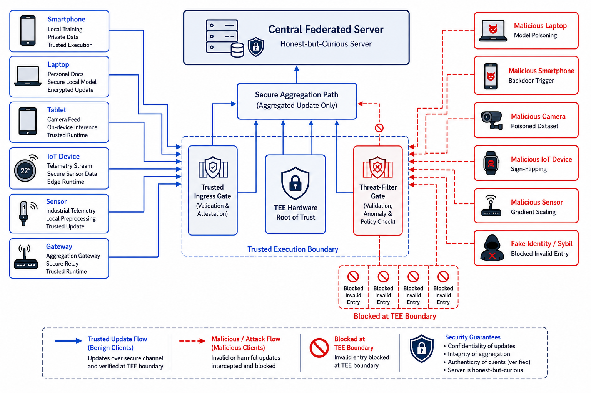

## Slide 5: 总体方案：信任流驱动的五阶段闭环
- Key points:
  - 阶段一：TEE 硬件准入与运行监测。
  - 阶段二：纯净参考方向与内容一致性审查。
  - 阶段三：HistPerf 与 RiskEMA 双流信誉演化。
  - 阶段四：分层门控、重归一化与动态裁剪。
  - 阶段五：全局模型下发与状态留存。
- Visual idea: 以论文架构图为主视觉，右侧给出“信任状态连续传递”的短链路。
- Layout role and intent: architecture; 总览已完成的技术路线。
- Required images:
  - 五阶段防御闭环架构；strict input asset; 保留模块名称和流程箭头。

    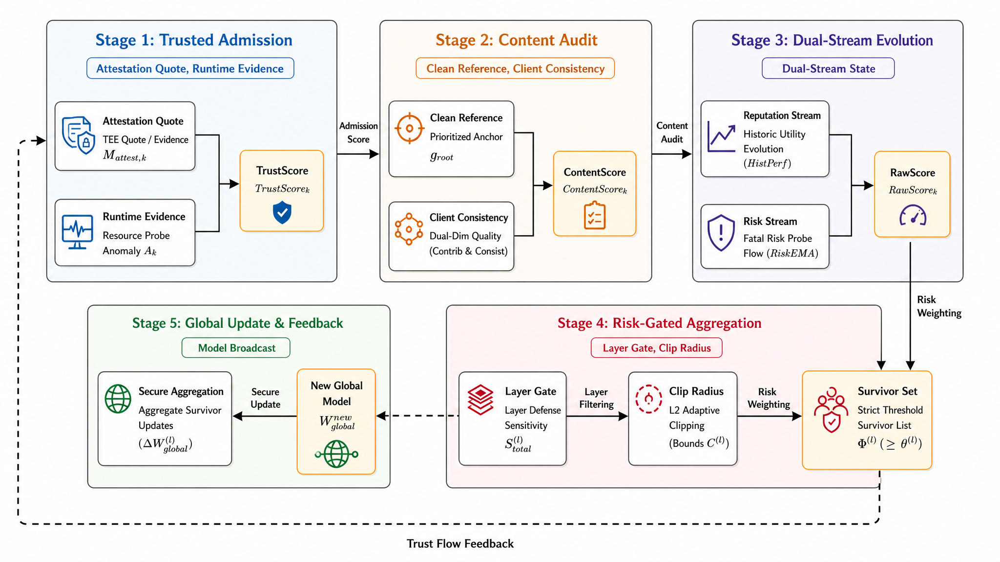

## Slide 6: 已完成工作一：TEE 锚定准入与内容审查
- Key points:
  - 远程证明确定客户端初始接入边界。
  - TMAA 监测梯度、损失和指令分布等运行特征。
  - 熵驱动卡尔曼滤波将运行波动转化为动态 TrustScore。
  - 纯净参考方向用于提高合谋攻击下的内容审查稳定性。
- Visual idea: 用“硬件门禁 -> 动态信任 -> 内容得分”的横向流程图表达。
- Layout role and intent: method detail; 展示第一、二阶段的实现进展。
- Required images: none.

## Slide 7: 已完成工作二：双流信誉演化与状态管理
- Key points:
  - HistPerf 作为长期效用流，吸收强 Non-IID 下的合法短期波动。
  - RiskEMA 作为瞬时风险流，快速放大后门和参数篡改等异常。
  - 状态机支持 NORMAL、SUSPECT、QUARANTINE、BLACKLIST 分级处置。
  - 目标是在 FPR 与 ASR 之间打破单一信誉分的冲突。
- Visual idea: 左侧状态机图，右侧用两条竖向信号流说明双流正交解耦。
- Layout role and intent: method detail; 解释低误杀和高召回的机制基础。
- Required images:
  - 客户端监管状态转移自动机；strict input asset; 保留状态名称和转移关系。

    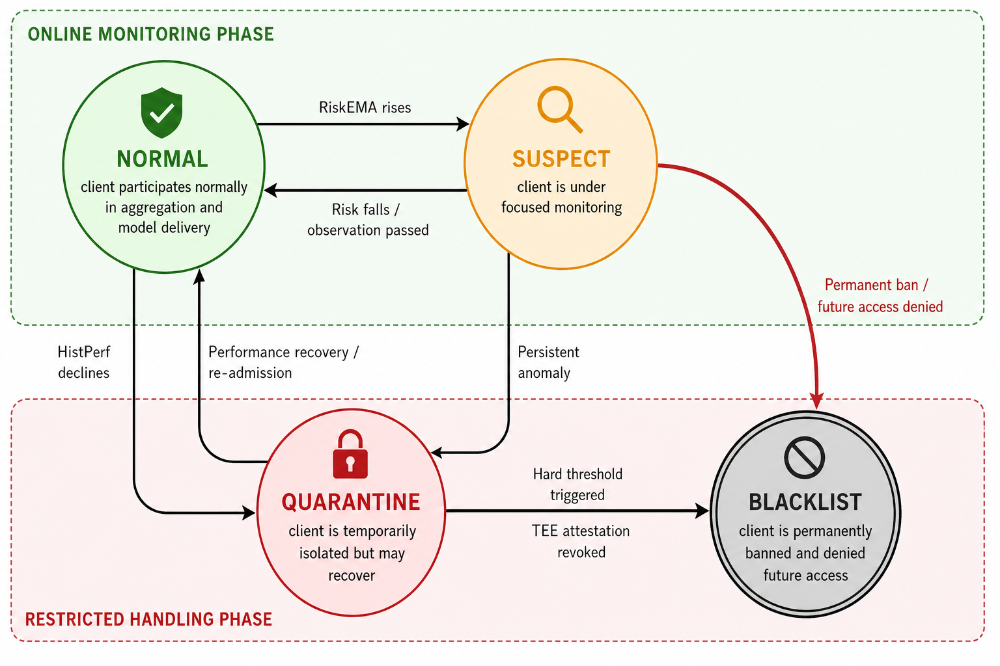

## Slide 8: 已完成工作三：分层风险门控聚合
- Key points:
  - 后门特征常在网络深层更隐蔽，统一聚合容易发生跨层透传。
  - 按层估计隐私、效用和安全敏感度，动态确定准入门槛。
  - 幸存者权重重归一化避免“隐性学习率衰减”。
  - 动态 L2 裁剪约束高风险更新幅度。
- Visual idea: 以分层聚合图为主，配三个小标签：门控、重归一化、裁剪。
- Layout role and intent: method detail / process; 展示聚合阶段的关键创新。
- Required images:
  - 分层自适应审查与动态裁剪机制；strict input asset; 保留层级和门控关系。

    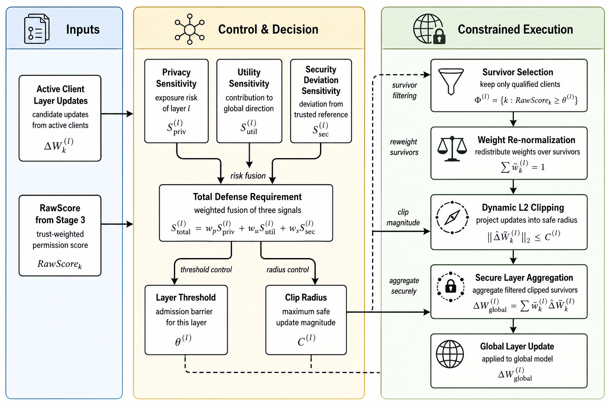

## Slide 9: 实验平台与攻击配置
- Key points:
  - 基于 Flower 1.5.0 与 PyTorch，实现端到端联邦仿真。
  - 数据集：CIFAR-10；20 个正式客户端；Non-IID 采用 Dirichlet alpha=0.1/1.0 分组。
  - 6 个恶意节点覆盖标签翻转、触发器后门、干净标签后门、语义后门、符号翻转、梯度缩放。
  - 额外 5 个 Sybil 与 3 个 Free-rider 在准入阶段被前置拦截。
- Visual idea: 用参数卡片 + 攻击矩阵列表表达，保持模板的大字号少文字风格。
- Layout role and intent: experiment setup; 说明实验可信度和复现条件。
- Required images: none.

## Slide 10: 阶段性结果一：收敛与攻击抑制
- Key points:
  - 30% 恶意占比下，模型准确率稳定收敛到 92.31% (+/- 0.09%)。
  - 后门攻击成功率 ASR 降至 10.21% (+/- 0.05%)，接近随机猜测基线。
  - 50% 边界压力下仍保持 91.81% 准确率、10.46% ASR。
  - TPR=100%，永久封禁口径 FPR=0%。
- Visual idea: 左侧放 Acc/ASR 曲线，右侧放四个关键指标数字。
- Layout role and intent: data evidence; 给出最核心的中期实验结论。
- Required images:
  - 全局收敛准确率与 ASR 曲线；strict input asset; 保留数据、坐标、图例和曲线。

    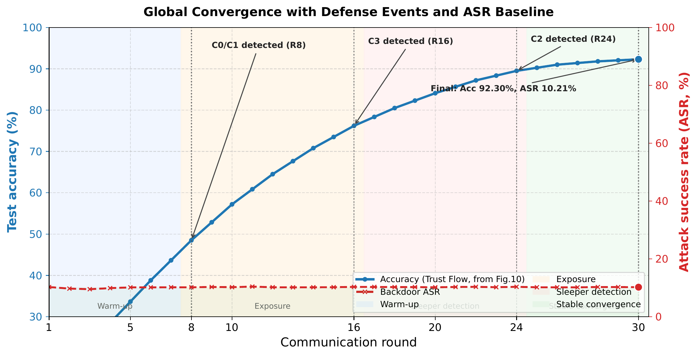

## Slide 11: 阶段性结果二：节点追踪与横向对比
- Key points:
  - 风险流可追踪显性投毒、参数篡改和隐蔽潜伏后门的不同触发路径。
  - 合法长尾节点仅受可逆隔离或降权，不触发永久封禁。
  - 与 FedAvg、Krum、Trimmed Mean、FLTrust 相比，本文在 Acc、ASR、FPR 上保持综合优势。
  - t-SNE 可视化显示双流干预后恶意簇与合法长尾簇更可分。
- Visual idea: 用节点轨迹图和 t-SNE 图做双图并排，角落放对比结论。
- Layout role and intent: data evidence / comparison; 支撑机制有效性而非只展示最终数字。
- Required images:
  - 核心节点信任与风险状态时序追踪；strict input asset; 保留曲线和标注。

    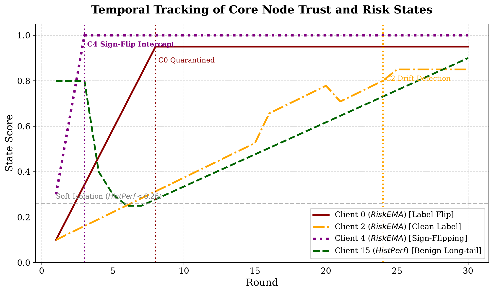

  - t-SNE 降维对比；strict input asset; 保留点簇、颜色和图例。

    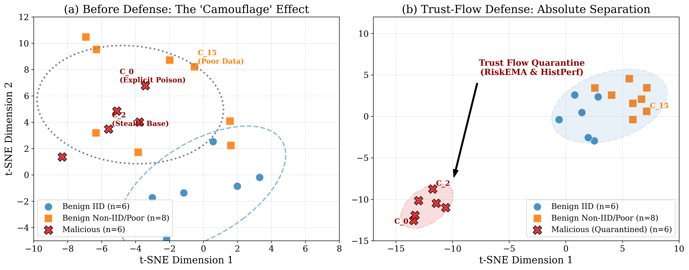

## Slide 12: 消融分析与参数敏感性
- Key points:
  - 双流正交解耦在最终封禁口径下实现 FPR=0%、TPR=100%。
  - 全维深层探针将 Clean-Label Backdoor ASR 压制到 9.2%。
  - 分层门控 + 重归一化使最终精度恢复到约 92.4%。
  - 在 Dirichlet alpha=0.1 的强异构环境下，传统方法明显退化，本文仍稳定约 92%。
- Visual idea: 采用 2x2 小图矩阵，突出每张图的结论标签。
- Layout role and intent: ablation / robustness; 说明结果来自关键模块贡献。
- Required images:
  - 多维风险探针对不同攻击类型的 ASR 压制；strict input asset。

    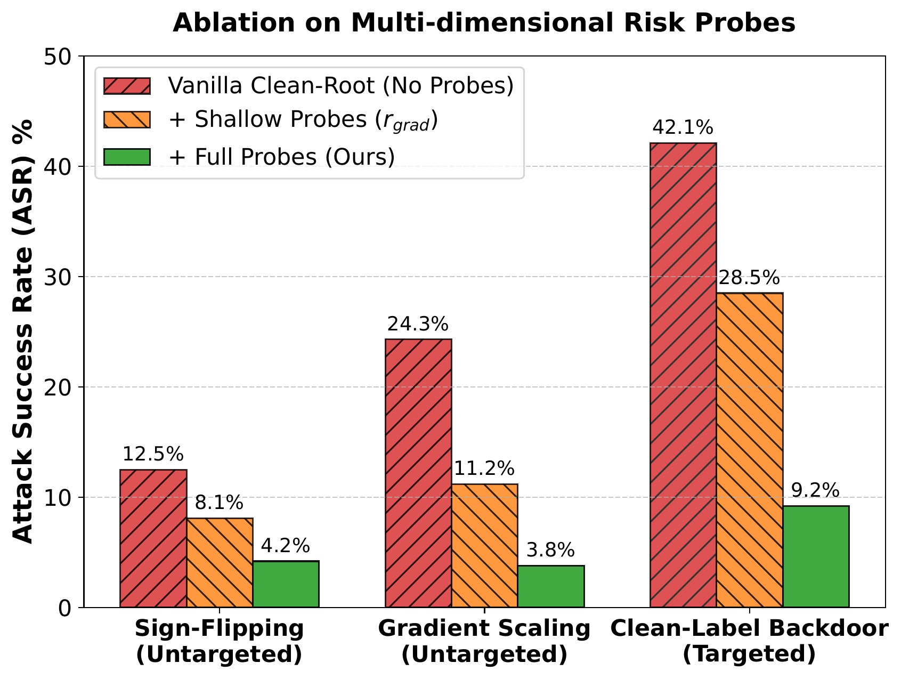

  - 动态权重重归一化对收敛的增益；strict input asset。

    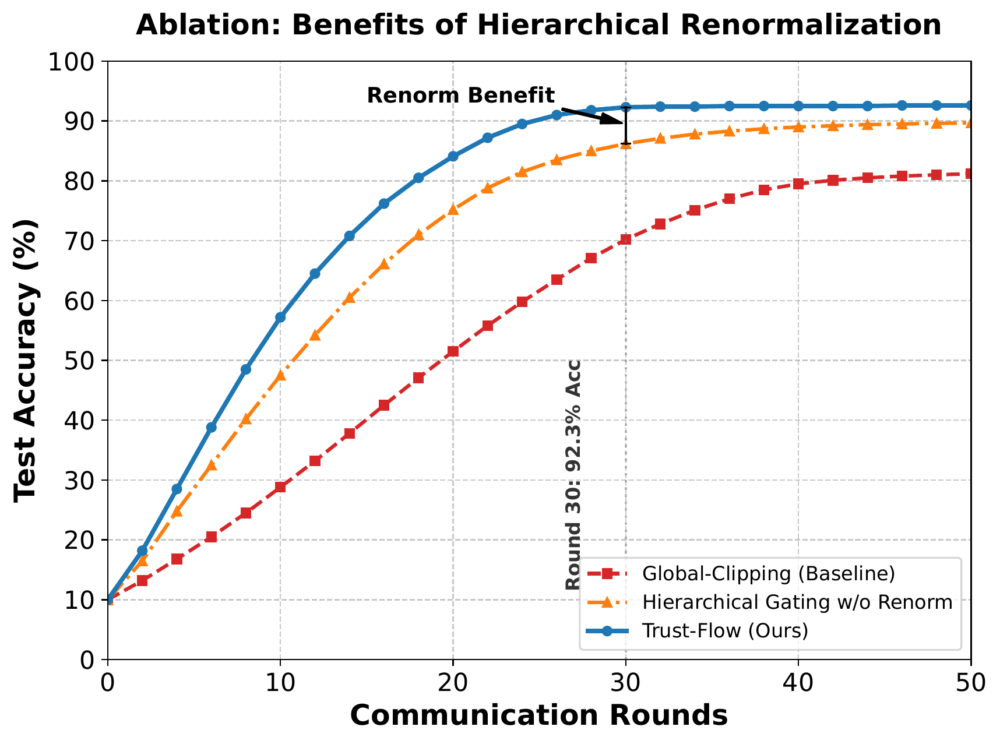

  - Dirichlet 异构度敏感性测试；strict input asset。

    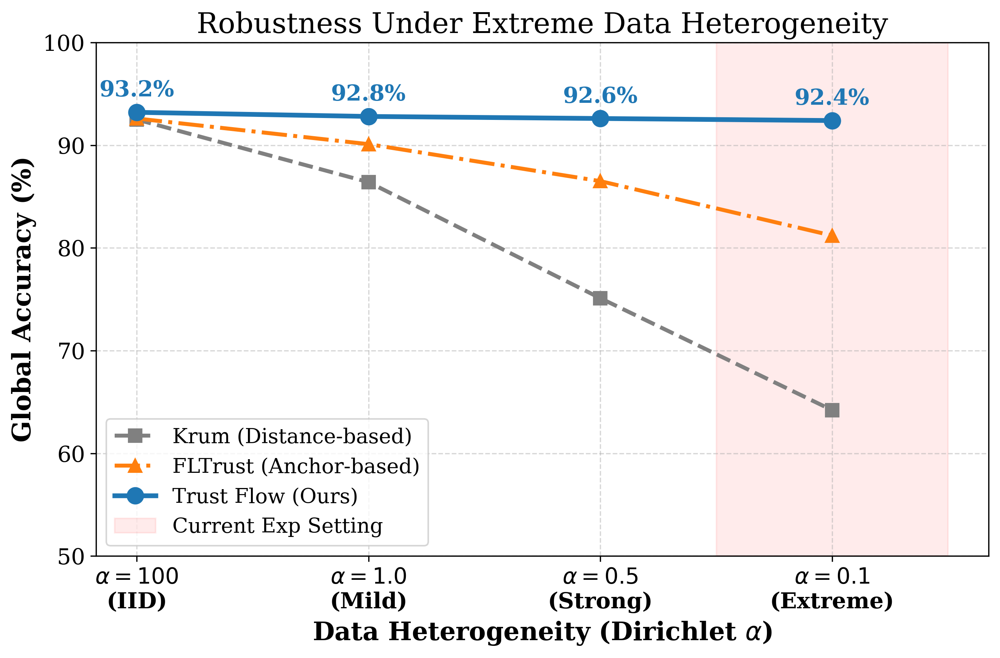

## Slide 13: 中期进展总结与后续计划
- Key points:
  - 已完成：问题建模、核心算法设计、Flower/PyTorch 实现、混合攻击实验、消融与压力测试。
  - 待完善：代码结构整理、实验日志归档、更多同构基线与跨场景验证。
  - 论文层面：继续打磨方法叙事、图表一致性、局限性与可复现描述。
  - 后续方向：开放代码与脚本，并尝试扩展到 LLM/NLP 联邦微调任务。
- Visual idea: 左侧进度轴展示“已完成/进行中/下一步”，右侧列出风险与应对。
- Layout role and intent: timeline / next steps; 满足中期答辩对进度和计划的要求。
- Required images: none.

## Slide 14: 致谢与提问
- Key points:
  - 感谢各位老师批评指正
  - Q&A
- Visual idea: 复刻模板结束页，中心大字，保留学校视觉识别。
- Layout role and intent: closing / Q&A; 干净收束。
- Required images:
  - 模板结束页风格参考；style-only reference。

    
